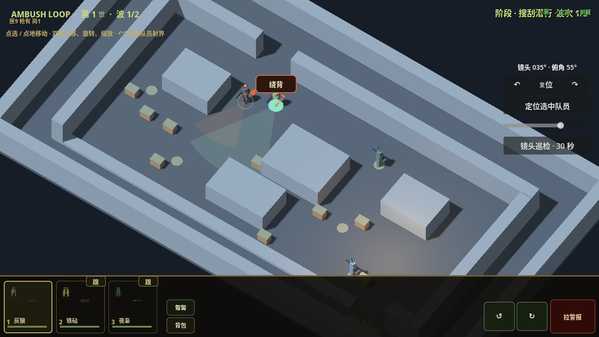
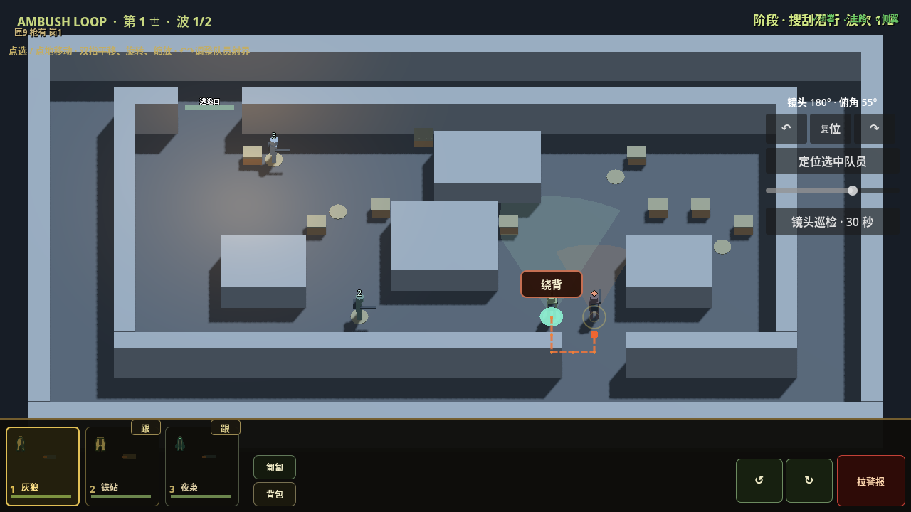

# 可旋转院子：A0 执行目标与记录

日期：2026-10-02（Asia/Shanghai）。用户指令：设定目标，按计划执行。

总目标：更写实、厚重的战术游戏资产；暮色工业院落，冷灰环境光与局部暖灯；水平 360° 旋转、受限俯角和缩放；中端安卓稳定 30 FPS，高配可选 60 FPS。

本阶段目标：**可旋转、可点选、保持原战术结果的院子原型**。它是技术灰盒，不是最终美术。完整路线以 [PR #14 的执行计划](https://github.com/hailinsu-create/ambush-loop/blob/d69251be42d5f96c99da48a24a3923b62863f28f/.cursor/docs/AMBUSH_ASSET_EXECUTION_PLAN_20261002.md) 为准；该计划替代设计 v2 的固定镜头约束。当前实现分支从主线 `c1aaf27c23f8f711f23305bf6f3223c38cb69098` 建立，不包含其他在制高度玩法分支。

## 执行切片与退出条件

| 切片 | 交付 | 退出条件 | 状态 |
| --- | --- | --- | --- |
| A0.0 | 匹配引擎、源版本、隔离基线和 Android 工具准备 | 官方包校验；导入/隔离/寻路/六关测试实际退出码；设备工具状态明确 | 云端完成 |
| A0.1 | 统一坐标、只读表现状态、命令接缝 | 不向模拟复制显示状态；旧视图行为保持；转换与拒绝非法命令通过 | 云端通过 |
| A0.2 | 独立 3D 院子场景、镜头、点选、手势与遮挡 | 8 方位/俯角/缩放检查；旋转与静止战果一致；实际运行图片或录屏 | 灰盒云端通过；成品建筑遮挡接入留在 A2 |
| A0.3 | 样板 APK 与早期设备探针 | 记录中端安卓型号/系统/GPU/触控/渲染数据，修正资源预算 | APK 已构建；真机待测 |

A0 之后按 A1 资产基准 → A2 完整院子 → A3 真机封样 → A4 其余五关推进。没有设备证据时不得宣称 A0.3/A3 通过；可以继续小批源资产和云端检查。

## 实施边界

- 既有战斗逻辑是唯一状态来源。保留 60 Hz 模拟、伤害、弹药、路线、冻结计划与存档契约。
- 新视图先通过独立开发场景进入，正式入口在样板验收后切换。
- 隔离旧世界的绘制，不更改单位的 `visible` 参与标记，不停止逻辑节点处理。逐项记录过渡期表现开销。
- 3D 画面只消费复制的数据；回放只消费历史快照，不用当前装备补写历史，不修改活体 HP/弹药/存活。
- 拾取返回明确的有效状态；手势一旦进入双指操作，释放前不提交单指命令。UI 优先捕获。
- 默认正交镜头、俯角 55°（35°–65°）；每格 1 米。数值为待验证的初值。
- 工具安装已获用户授权，安装到工作区独立目录；不提交工具包、APK、玩家数据或签名。

## 验证记录

源码基线 `c1aaf27c23f8f711f23305bf6f3223c38cb69098` 已包含合并的 PR #11/#12。实现位于 Draft [PR #15](https://github.com/hailinsu-create/ambush-loop/pull/15)，普通正式入口仍保留旧视图。网页 GPT PLAN/REVIEW：unavailable。

### 工具与来源

- Godot `4.7.2.stable.official.ed1daf0bf`，官方 godot-builds release；Linux ZIP SHA256 `cadd3204e728a35d3f13adb7fd0d7902636b79f6b95c40c265eb73b6c35329e4`。
- 匹配导出模板 `4.7.2.stable`，官方 TPZ SHA256 `f298490b8d44d934be425a5a65a51bf15f422428b229a06a6e11d9ffea248011`。
- Temurin JDK `17.0.20.1+1`、Android SDK platform 36 / build-tools 36.0.0 / adb 37.0.1；Blender 4.3.2、FFmpeg 7.1.5。工具放在云端工作区，未修改系统默认 Godot/Java。
- 云端图形：Xvfb 1280×720、Mesa llvmpipe Compatibility；不代表安卓性能。已安装 Android 14 API 34 x86_64 软件模拟器；主机无 `/dev/kvm`。

### 可复核结果

基线目录独立于开发目录。下列测试全部通过隔离包装器，表内为已实际取得的退出码。

| 源码/检查 | 退出码与结果 | run ID / 证据 |
| --- | --- | --- |
| 基线导入 / 存储探针 | 0 / 0 | `d6032ca8bca74c0da7b889caa2b2ef06` / `9536b30ed80a40df828b315ce984967d` |
| 基线寻路 | 0，504 case / 311 oracle | `fb898711e20441d4b048c6a2c0346f21`；fingerprint `0b77fff7d2d836cb1eccb589891c1c5f3a6bf5c63b25ea3a8a369e2d6e3aad45` |
| 基线六关完整冒烟 | 0，`SMOKE_SLICE_COMPLETE` | `9d6a244556054641a67dc497748f2fd4` |
| `1331d97` 冻结目录完整六关冒烟 | 0，六关参考战果与典型循环通过 | `72af153d0f5e4db7a6f7cbff7a150a6b`；[日志](evidence/20261002-a0/smoke.log) |
| `1331d97` 表现合同 | 0，84,039 检查；72 个姿态 / 48,416 可见格子采样 | `9ea6830c844546b288e92483922a6cd9`；[日志](evidence/20261002-a0/presentation-contract.log) |
| `1331d97` 原生输入事件管线 | 0，38 检查 | `f239dbdbbd724648893bf3be4fa55b65`；[日志](evidence/20261002-a0/input-events.log) |
| `1331d97` 手势状态机 | 0，20 检查 | `79ed81ac44a64aca9b502687cb5cd91b`；[日志](evidence/20261002-a0/gestures.log) |
| `1331d97` 实际渲染 | 0，8 方位、俯角两端、战斗旋转 | `fabf6b7cf23043f79c4b6205d3a3b839`；[日志](evidence/20261002-a0/capture.log) |

30 FPS 旋转、60 FPS 静止、60 FPS 旋转且 2×播放，三组终局均为 tick 1056 / 22 个事件，HP、弹药、存活与事件序列一致。旧回放缺字段使用中性值，拖动不修改活体；双指/取消/UI 捕获不漏出战术命令。镜头巡检失焦会取消并恢复镜头。

开发过程中一次冒烟已经到完成标记，但包装脚本被同时修改，导致 shell 收尾解析失败；该次不计通过。上表是冻结目录重新执行后的完整退出码 0。

当前灰盒含旧 HUD 的默认画面为 267 draw calls / 10,038 primitives，超过暂定 200 draw calls 警戒值；A2 必须处理 HUD/代理提交开销，不得把灰盒已显示等同于性能达标。截图来自云端，角色仍是代理方块；工具/完整特效、成品屋顶与回放视觉字段覆盖尚未迁移完。

### APK 与设备

最新灰盒包为 `0.7.0-a0.2` / code `2026100202`，源码 **`1e9863ba0e9c007b0fb612d8dd5f705fa7f374d7`**，干净源副本构建。后续 A1 源资产不包含在此包中。

- arm64 包名 `com.ambushloop.game.a0`，独立调试签名和设置域，可以与 `com.ambushloop.game` 并存。
- 实际导出、`aapt` 身份/ABI 检查、`apksigner verify` 全部退出 0；29,624,703 bytes，SHA256 `d5a4d33743c6d1ee1b20f237be3ff1a94384695ca56bf0a28e22956f00b09b83`。见 [构建清单](evidence/20261002-a0/apk-manifest.json)。
- 720p viewport、30 FPS 上限；最多每物体 4 个局部灯，阴影 1024。原始软件模拟器发现默认 GLES 着色器 uniform 超限，已收紧到场景实际预算；模拟器启动/后台验证状态以最终 Android 记录为准，不将安装成功等同于启动通过。
- 已提供 30 秒镜头巡检：2 秒预热后记录帧间隔、p95/p99、GPU、机型、draw call 和纹理内存，可复制 JSON。不会强制开战或修改计划；这不是 30 分钟持续性能验收。
- 用户可用设备：**努比亚 Z60 / Android 14**。具体型号后缀、SoC/GPU、内存和实际数据尚未读取；不把它直接认定为中端基准机。用户要求能在云端做的测试尽量由代理完成。

Android 软件仿真实际完成了 x86_64 APK 安装与引擎/GLES 初始化，尝试 SwiftShader、host Mesa 和 ANGLE/SwiftShader。由于主机无硬件虚拟化，Android 系统本身出现 ANR，启动停留/后台与输入检查未能可靠完成，**不计 Android 启动通过**。见 [初始化日志](evidence/20261002-a0/android-software-logcat.log) 与 [系统 ANR 证据](evidence/20261002-a0/android-system-anr.png)。arm64 真机尚未运行。

交付文件已保存在工作区：`deliverables/ambush-loop-a0-20261002/` 的 APK、manifest、11.5 秒实际旋转录屏（录屏源码 `1331d97`，捕获包装器退出 0）。尝试 GitHub Draft Release 附件上传时，`uploads.github.com` 被当前云端 restricted 网络策略拒绝；没有绕过策略，空的 Draft Release 已删除。源码/精选证据仍通过 GitHub PR 同步；APK 没有写入 Git 仓库或正式发布。

## 当前状态与下一步

A0 的云端功能检查完成，A0.3 保持真机待测。已按计划允许的范围推进 [A1 源资产样板](AMBUSH_ASSET_A1_SAMPLE_20261002.md)。下一门槛是实机确认路线、角色/动作样板与完整院子接入；A2/A3/A4 没有完成，不切换正式入口，不合并新 PR。
