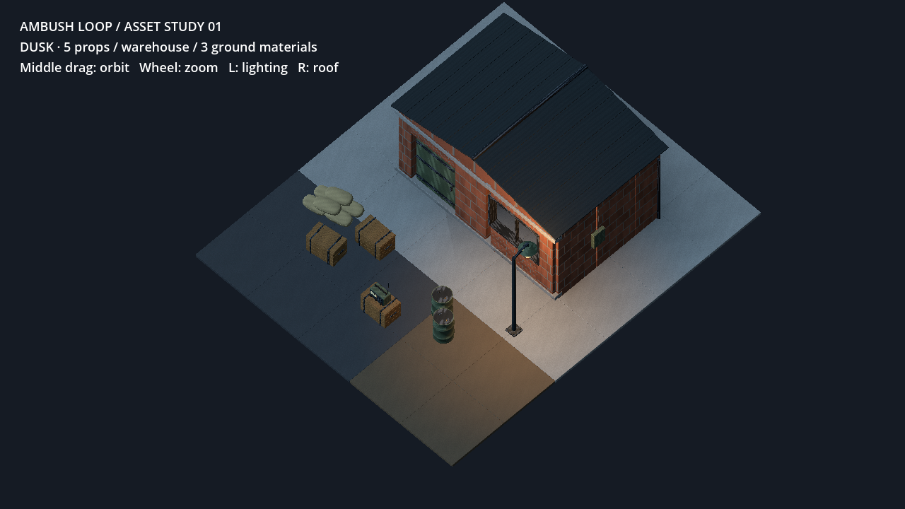
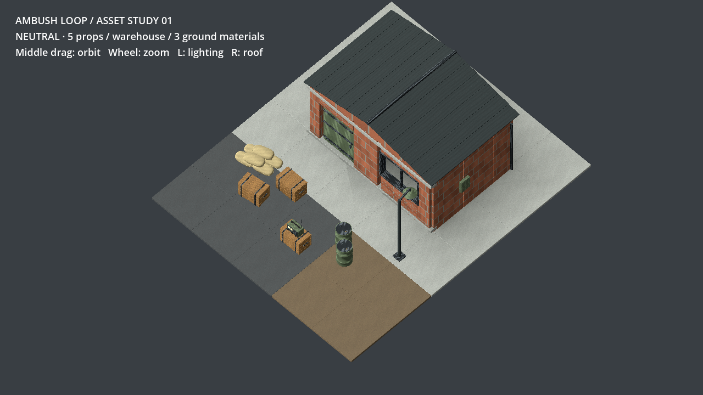
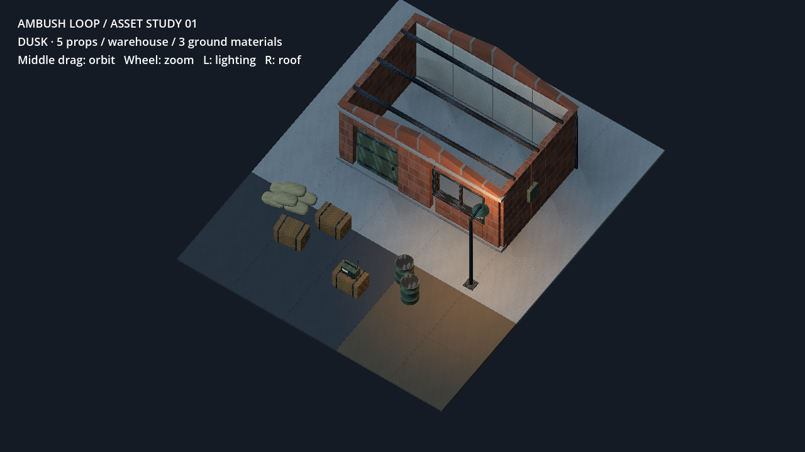
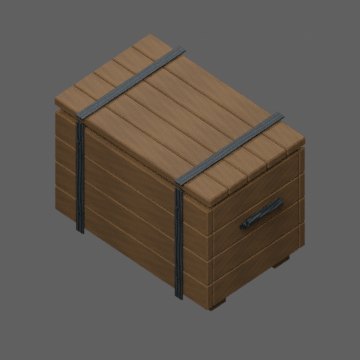
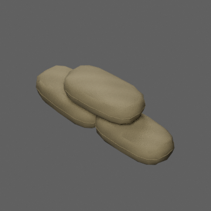

# A1：首批多角度资产样板记录

日期：2026-10-02。来源：已确认的 PR #14 资产执行计划；A0.3 缺真实设备数据时允许小批源资产。目标是建立可重建、可旋转、可复核的道具/建筑制作链。人物、音效、完整关卡和性能封样仍未完成。

源提交：`db2b724af8a583a54f44dd9e38548d1700fce27b`。制作入口：[Blender 源说明](../../ambush_loop/ArtSource/v2/README.md)；[资产台账](../../ambush_loop/art/v2/manifest.json)。全部几何/纹理为原创程序生成，源 `.blend` 包含打包贴图；没有调用第三方付费服务。

| 资产 | LOD0 / LOD1 三角面 | surfaces | 当前状态 |
| --- | --- | --- | --- |
| 木补给箱 | 1604 / 882 | 1 | 源文件、导出、双光照评审场景 |
| 沙袋组 | 1620 / 858 | 1 | 完整曲面与接缝；远景仍需品质复核 |
| 油桶 | 844 / 463 | 1 | 桶筋、桶盖、注油口 |
| 电台 | 812 / 446 | 1 | 表盘、调谐旋钮、扬声器、提手/天线 |
| 灯具 | 572 / 310 | 2 | 灯罩/护笼与独立发光材质、暖灯挂点 |
| 仓库片段 | 2828 / 1550 | 7 | 四面墙、可拆屋顶、门、结构细节分离 |
| 混凝土 / 沥青 / 泥地 | 各 44 / 24 | 各 1 | 2×2 米模块 |

共享 1024² Albedo / Normal / ORM 图集。GLB 不重复嵌入贴图，通过 `asset_library.gd` 绑定共用材质。单位/前向/地面原点、哈希、预算和用途在台账记录，模型均为 `visual_only`；尚未替换战场逻辑物体。LOD1 已导出并供评审切换，战场自动 LOD 尚未接入。

## 实际验证

- Blender 4.3.2 批量构建与重新构建均退出 0；两次 manifest 全字节相等，包括 18 个模型和三张贴图哈希。制作脚本 hash 也写入清单。
- `validate_exports.py` 退出 0：9 资产、18 LOD、23,665 顶点，索引、有限坐标、单位法线、UV 范围、原点/尺寸和预算通过。见 [日志](evidence/20261002-a1/exports.log)。
- Blender CPU/Cycles 原始材质转台：五道具各 8 方位，40 帧，退出 0。本机 Blender 不含 OpenImageDenoise，使用 24 samples，不依赖该可选模块。
- Godot 4.7.2 Compatibility 导入/实际渲染均退出 0。23 张：中性/暮色各 8 方位、近景、拆顶、35°/65°俯角和远景 LOD0/1。最终捕获脚本提交 `81ff89e`，run ID `8e89af6e28e541ceb8696b1a0511b797`，见 [日志](evidence/20261002-a1/capture.log)。最后 LOD1 远景为 95 draw calls / 11,294 primitives；仅是评审场景的云端计数。
- 初轮画面复核已修正砖纹方向、木纹方向、地面过强周期纹理、屋顶局部变换和源文件误导入问题。两个退出泄漏警告定位为 Dummy 音频驱动的背景播放；捕获脚本提前停止音乐并等待一帧后，最终日志没有该警告。这不替代 Android 生命周期验证。

## 状态和下一步

A1.0 管线已有实物和重建证据；A1.1 为首批源资产与引擎样板，保留品质复核状态，不把它当成最终写实程度或移动端验收。待补：远景闪烁/抗锯齿与材质细节调校、仓库外墙的相机遮挡接入、人物比例对照。A1.2 步枪手/敌人/共用骨架/六动作尚未制作。

A0 灰盒 APK 不包含本批模型。下一步沿 A1.2 → A2 完整院子推进；用户随后要求先完成全部制作与接入，设备验证顺序由[执行顺序 v2](AMBUSH_ASSET_EXECUTION_PLAN_20261002_v2.md)替代，云端图形计数仍不能证明真机性能。网页 GPT PLAN/REVIEW：unavailable。
