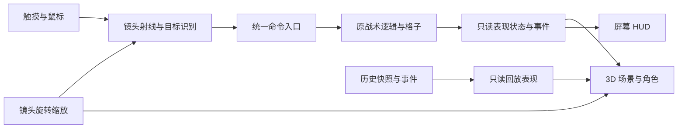

# Ambush Loop：写实资产与可旋转场景执行计划

日期：2026-10-02（Asia/Shanghai）。计划版本：1。状态：**规划完成，实施切片尚未开始。** 用户目标及性能档位已确认；本文件中的工程参数是首轮实施默认值，须依据样板测量调整并记录。

交付入口：[Draft PR #14](https://github.com/hailinsu-create/ambush-loop/pull/14)。代码基线：`c1aaf27c23f8f711f23305bf6f3223c38cb69098`；规划前分支提交：`42ec066bcce102e04aaad63454b3eab830851f40`。

## 1. 目标、范围与有效性

用户已确认：

- 全面提升场景、人物、武器、道具、动画、特效、声音和 UI 的资产质量，追求更写实、厚重的经典战术游戏质感。
- 场景支持水平 360° 自由旋转、受限俯角和缩放。
- 第一关以暮色工业院落为品质基准：冷灰环境光、局部暖灯，人物与材质仍需清晰。
- 主流中端安卓稳定 30 FPS，高配可选 60 FPS。
- 工具不限；可用 Blender、AI 及其他适合的工具，缺少工具可按需安装。

本计划将[资产讨论稿](AMBUSH_ASSET_UPGRADE_20261002.md)第 4–8 节的候选方案细化为实施默认值、任务顺序和验收条件，保留该稿的盘点、图片及需求来源。设计 v2 的固定镜头要求已被旋转需求替代；六关、三名队员、安卓横屏、离线、SCOUT → ALERT → SWEEP、冻结计划和发行门槛继续有效。

首个可交付成果是**可真实操作、旋转并完成战术循环的写实院子样板**。全项目完成范围仍包括六关；院子是建立共用标准的第一批。首轮不修改伤害、资源、路径和关卡解法，不加入联网、第七关、全图迷雾或战中移动。可行走高台与高度 LOS 是另外的玩法切片；未实现规则前不开放只有外观的可用高台。

## 2. 已核实的依赖

| 事实 | 实施影响 |
| --- | --- |
| 当前有 14 个源 GLB、13 张已引用的固定角度 PNG、45 个程序音效 cue | 保留用途和 ID；原模型需重新评估结构、UV、材质和合批，不能直接充当成品 3D 资产 |
| `main.gd`、`operator.gd`、`enemy.gd`、`c2_director.gd` 直接读取二维节点位置；多处把 `op.visible` 用作参与游戏的条件 | 必须建立表现适配；不能通过设置单位 `visible=false` 或整体停止节点处理来替换画面 |
| `_screen_to_world()` 使用二维画布逆变换，桌面与触摸入口还直接读取全局鼠标位置 | 新增统一拾取/命令入口，逐一切换桌面、触摸、转向、工具和上下文操作 |
| `SimClock` 为 60 Hz，回放每 6 tick 记录一次，即约 10 Hz | 30 FPS 渲染不降低模拟频率；回放与实时动画的数据来源分开处理 |
| 旧快照只有部分位置、朝向、HP、弹药和角色信息；敌人缺朝向，双方缺装备/完整姿态字段 | 新视觉字段采用可选补充；旧快照用明确的兼容表现，不能借当前活体节点伪造旧状态 |
| 默认 Godot 是 4.6.3，工程固定 4.7.2；Blender 4.3.2、FFmpeg 7.1.5、Python 3.12.14 可用 | A0.0 安装并验证匹配引擎，之后才建立新测试基线 |
| 当前默认 Java 是 21，仓内 M0 工具要求 JDK 17；当前 PATH 未发现 `adb`、`sdkmanager` | Android 验证前核实已有 SDK 目录，再按需补齐 JDK 17、platform-tools、platform android-36、匹配 build-tools 与导出模板；按命令选择工具路径，不依赖全局默认版本 |

已查询[官方 Godot 4.7.2 发布页](https://github.com/godotengine/godot-builds/releases/tag/4.7.2-stable)：Linux 标准包为 77,860,424 字节，API 提供的 SHA-256 为 `cadd3204e728a35d3f13adb7fd0d7902636b79f6b95c40c265eb73b6c35329e4`。本轮仅核对发布元数据，尚未下载或校验文件本体。Android 导出模板按同版本安装；先做原型无需提前下载全部平台模板。

代码依据：`scripts/main.gd::_process/_sim_tick/_snapshot_data/_screen_to_world/_on_replay_pressed`、`scripts/simulation/sim_clock.gd`、`scripts/replay/battle_log.gd`、`scripts/grid.gd`。资产依据见[盘点数据](evidence/asset-audit-20261002/inventory.json)。

## 3. 技术方案与边界

### 3.1 单一逻辑状态，独立 3D 表现

采用 Godot 实时 3D 场景、模型、镜头，加屏幕空间 2D HUD。现有战术逻辑继续决定移动、开火、伤害、掉落、胜负和存档；3D 表现读取状态与事件，输入经过命令入口返回原逻辑。



第一步保留旧二维逻辑实体及其处理顺序，另接 3D 表现节点；旧 World 的绘制隔离与单位参与状态分开。逐项审计 `visible` / `is_visible_in_tree` / 视觉回调的使用，不能把显示开关当作逻辑开关。旧的视觉构建和特效创建逐个由表现入口接管，记录过渡期 CPU 成本；不以隐藏画面代替最终去除无用渲染开销。

旧视图作为开发/回归模式保留，模式切换不暴露到玩家流程。初期在独立院子测试场景启用 3D；完整样板验证后再改变玩家默认入口，后续逐关迁移。`main.gd` 的改动集中于接缝，不先进行整个战斗系统重写。

### 3.2 建议模块与接口

下列文件名是实施目标，尚不存在。

| 模块 | 责任与契约 |
| --- | --- |
| `scripts/presentation/world_space.gd` | `logic_to_world`、`world_to_logic`、朝向向量换算；所有 2D/3D 转换只经此处 |
| `scripts/presentation/view_state.gd` | 构建只读视图状态：会话、阶段、tick、实体类别/ID、位置、世界朝向、参与/存活、装备、姿态；不持有可写的模拟字典引用 |
| `scripts/presentation/presenter_3d.gd` | 按稳定实体 ID 管理模型、姿态与效果；消费状态，不推进模拟、不改变存档 |
| `scripts/presentation/camera_rig_3d.gd` | 焦点、yaw、俯角、缩放、边界、复位；与角色世界朝向无关 |
| `scripts/presentation/world_picker_3d.gd` | 屏幕→射线→实体/可走地面→逻辑坐标；返回明确有效/无效结果，不以零坐标代表失败 |
| `scripts/input/command_router.gd` | 选择、移动、朝向、拾取、掩体和工具的统一入口；复用原阶段/锁定/资源校验 |
| `scripts/presentation/occlusion_controller.gd` | 屋顶与墙段按观察关系隐藏/切开，恢复状态；不改变导航和战斗 LOS |
| `scripts/presentation/replay_presenter_3d.gd` | 读取历史快照，独立管理回放代理与时间；禁止回写活体单位 |

实时 SCOUT/SWEEP 读取当前逻辑更新后的状态，ALERT 读取固定步进后的状态；保持现有时序。事件以 `(run_id, seq)` 去重，防止 30/60 FPS 或多次刷新重复触发音效、枪口和命中。旧音效入口与新音效路由始终只有一个播放所有者。

### 3.3 坐标、镜头与交互默认值

| 项目 | 首轮默认值与规则 |
| --- | --- |
| 世界比例 | 1 格 = 1 米；逻辑仍保留 32 像素/格、40×22 格。院子世界中心为原点 |
| 位置转换 | `X = logic.x / 32 - 20`，`Z = logic.y / 32 - 11`；基础地面 `Y = 0`。反向转换只由适配模块计算 |
| 模型方向 | 运行资产 +Y 朝上、-Z 朝前；逻辑朝向先转成 X/Z 方向向量，再对齐模型，避免分散写补偿角 |
| 投影 | 首版正交；默认俯角 55°，范围 35°–65°；水平连续旋转，yaw 跨 0°/360°不跳变 |
| 缩放 | 正交视野高度初值 24 米，范围 12–36 米；最终以 720p 和目标机实际人物尺寸调校 |
| 焦点 | 围绕地面焦点旋转，可平移；地图边界加约 2 格缓冲。一键恢复默认镜头/选中队员位置 |
| 触摸 | 单指点选/命令；双指平移、捏合缩放、扭转旋转。俯角先由独立控件调整；另保留显式旋转与复位按钮 |
| 鼠标 | 原有选中/命令语义保留；中键拖动旋转、Shift+中键平移、滚轮缩放、镜头控件调俯角；避免占用已有玩法键 |
| UI 优先级 | UI 捕获优先；双指手势开始即取消未提交的单指命令，所有触点释放前不重新解释为点地移动 |
| 射界与文字 | 射界、路径、陷阱在世界坐标中；标签/头像面向屏幕；保留方位提示和镜头复位，旋转不改角色朝向 |

正交是本计划的默认路线；只有同一场景/资产的对比证据证明弱透视更好且不损害点击与手机可读性，才在单独决策记录中更换。光照固定在世界空间，不随镜头旋转。

拾取层、展示遮挡层、逻辑阻挡分别定义。屋顶隐藏后不继续吞掉对单位的选择；建筑仍按格子/LOS 合同阻挡移动与子弹。所有未声明可交互的楼顶/台面不会因为射线命中就成为可走位置。

### 3.4 回放与兼容

保留旧快照字段及 10 Hz 记录节奏。新录制可增加可选的装备、敌人朝向、姿态等表现字段，并带版本标记；旧快照按角色/路线使用默认模型及中性姿态，缺失数据不从当前活体补写。首版仍按已有快照步进显示；平滑插值可作为后续表现优化，不能提前显示下一快照中的死亡、HP 或弹药变化。

回放拖动时不重播历史音效、不重新执行模拟、不向活体复制 HP/弹药/存活；退出恢复原冻结方案。新增镜头设置与画质设置单独存储在设置域，不混入战役进度；不清理玩家存档来处理迁移问题。

## 4. 资产制作标准

### 4.1 视觉基准与工具

建立一个稳定的资产评审场景：中性白光用于检查材质真实性，暮色冷灰环境光与暖灯用于检查游戏效果；同一资产在两者下验收。冷暖关系来自灯光与材质，避免把高光/阴影绘死在基础色里。优先读到人物、可交互物和出入口，细碎污渍不压过轮廓。

Blender 维护最终几何、UV、材质、骨架、动画和 LOD。规则建筑与道具尽量由可复现脚本/模块生产；服装、沙袋等有机物使用合适的建模或雕刻方法。AI 可用于设计参考、纹理/模型初稿；进入成品库前必须清理拓扑、比例、UV、材质和动作。

原型不依赖特定付费服务或 Meshy 凭据。现有工具能做的部分直接推进；确实需要新的外部账号/付费资源时，提供具体用途与成本再处理。常规工具安装已获授权。

### 4.2 源文件、导出物与台账

拟采用：

```text
ambush_loop/ArtSource/v2/        # 制作源、脚本、配置与源文件说明
ambush_loop/art/v2/             # 游戏使用的模型、纹理与材质
ambush_loop/audio/v2/           # 游戏使用的音效与环境声
ambush_loop/art/v2/manifest.json
ambush_loop/scenes/presentation/
ambush_loop/build/asset_review/ # 忽略的大图、临时烘焙、转台视频
```

复杂角色允许版本化的可编辑源文件，配套依赖说明和批量导出脚本；实施管线切片中同步调整 `ArtSource/README.md`，替代其只允许脚本作为唯一来源的旧限制。临时缓存、高模烘焙产物与所有测试帧不全部入库，精选证据和可复现命令入库。

每件台账至少包含：`asset_id`、类别、源文件、工具/版本、来源与使用条件、用途/逻辑 ID、单位/原点/前向、导出物、LOD、材质/纹理/碰撞分类、动画及挂点、哈希、验证场景和状态。状态分为概念、源资产、已导出、已接入、已验证；未知来源或未清理文件不能标记完成。

### 4.3 首轮预算

以下为设计预算，不是已测性能；超出时先提供实际视距收益及设备测量，再调整台账。

| 资产 | 首轮预算 |
| --- | --- |
| 三名主角 | 每人 LOD0 8k–12k 三角面，LOD1 约 4k–6k，LOD2 约 1.5k–3k；共用骨架，身体/服装/装备合计尽量 ≤3 个 surface |
| 普通敌人 | LOD0 4k–8k 三角面，较远使用 2k–4k；同类复用模型与材质，用装备轮廓区分职责 |
| 普通道具 | 通常 200–2,000 三角面，1–2 个 surface；细铁丝、栅栏需额外检查闪烁与远景成本 |
| 建筑模块 | 单件通常 0.5k–5k 三角面，共享 trim/material；屋顶、可切外墙和门按用途拆分 |
| 纹理 | 小道具 512–1k；主角和主要建筑材质 1k–2k；不默认使用 4K。启用适合设备的压缩与 Mipmap |
| 院子标准档 | 720p 起测，可见三角面暂以 ≤250k、draw call ≤200、纹理驻留 ≤192 MiB 为预算警戒值；以引擎/设备实测为准 |
| 光照 | 标准档先用 1 个主要阴影光源和少量无阴影局部暖灯；兼容路径不依赖高级 GI、体积雾或屏幕空间反射 |

沿用项目 Android 的 Compatibility 渲染路径建立首个稳定基线，验证法线材质、阴影与环境照明的实际支持。更高成本的渲染路径作为单独实验；未做设备 A/B 测量前不批量使用只有另一渲染器才支持的效果。

### 4.4 资产批次

| 批次 | 清单 | 完成定义 |
| --- | --- | --- |
| 材质道具基准 | 沙袋、木制补给箱、油桶、电台、灯具；一个含门窗、内外墙、可拆屋顶的仓库片段；2–3 种地面 | 形体可信、完整多面、材质分明、正确接地；8 个方位及俯角两端无破面或明显穿插 |
| 人物基准 | 一名步枪手、一名普通敌人、一把步枪；共同骨架与手/枪口挂点 | 实际游戏距离可辨敌我；待机、走、瞄准、射击、拿取、死亡完整，足底无明显滑移 |
| 院子成套 | 三名队员、院子需要的敌人类型、步枪/机枪/精准武器、交互补给/掩体/工具及首批环境物 | 从标题进入院子至结算、复盘、重试闭环，没有旧二维角色混在默认新视图中 |
| 共用库补齐 | 14 类现有道具逐件整理；10 枪及工具；四类敌人；跑动、蹲伏、部署、受击和拖拽等当前行为 | 每种既有游戏状态有资产/动作覆盖，保留逻辑与数值；装饰与可用物体易区分 |
| 六关主题 | 仓道棚架、泵站设备、信号楼桅杆、油库罐群、电台天线及各关地表/照明/声景 | 共用套件保持一致，各关主地标在不同观察方向可辨识 |

LOD、压缩、surface 合并在单件验收时完成，避免六关铺满后再整体返工。角色采用由逻辑位移驱动的原地动作，禁用会改变模拟位置的 root motion；动画时长不阻塞命中和伤害事件。

## 5. 声音、特效和 UI 的同步升级

- **音频**：给全部 45 个 cue 建替换表，可共用样本但必须保留用途映射。第一批完成三类主要枪声、金属/泥地脚步、开箱/拾取、命中/倒地与院子环境。统一响度、峰值和并发限制，音乐/SFX 可独立调节；暂停、后台、复盘、重试不会积压或重复播放。
- **特效**：枪口挂点→弹道/命中位置→材质反馈，与实际结算对应；烟尘控制遮挡和透明层叠，提供减弱动态设置；倍速/暂停采用模拟时间，UI 动效与战斗动效分开。
- **UI**：顶部目标与阶段、底部三人简卡、当前单位操作、一个阶段主按钮；默认只显示选中单位射界，完整战术信息按需展开。增加镜头复位与明确旋转入口，避免按钮与场景手势争用。
- **字体与图标**：选定可随包分发的中文字体及统一图标规范，记录来源；从同一模型渲染武器/物品图标，文字仍由引擎排版。
- **可用性**：修复 720p 结算溢出、适配实际手机安全区，静音/低光/色觉差异下仍能识别阶段和威胁。48dp 级触控目标按实际屏幕缩放换算，不将 Godot 像素直接当 dp。

## 6. 执行切片、依赖与退出条件

每行可拆为独立提交或聚焦 PR；A0–A4 沿用讨论稿编号。先完成前置退出条件，再批量扩展。主循环文件保持单写者。

| 切片 | 交付与主要入口 | 依赖 | 退出条件 |
| --- | --- | --- | --- |
| A0.0 工具与基线 | 安装 Godot 4.7.2 标准版并校验；记录 Blender/导出版本，核实并补齐 JDK 17/SDK 36 的 Android 工具链；保留干净源码及隔离测试基线 | 本计划 | 引擎版本和来源可追溯；隔离守卫、资源导入、寻路定向测试通过；全量基线有实际退出码；Android 工具准备状态明确 |
| A0.1 逻辑/表现接缝 | `world_space`、只读状态、统一命令入口；清查 `visible`、坐标和重复效果依赖 | A0.0 | 旧视图行为不变；坐标双向转换、空目标、阶段拒绝与快照不被写入均通过 |
| A0.2 可旋转院子灰盒 | `Camera3D`、院子几何、角色代理、射线点击、射界、屋顶遮挡及手势 | A0.1 | 8 个方向及俯角/缩放边界正确选中和移动；镜头运动不改冻结方案与胜负；真实运行录屏 |
| A0.3 初次设备探针 | 匹配模板构建样板 APK，记录中端机型号/系统/GPU/分辨率，检查触控与 3D 渲染 | A0.2 | 确认技术路线能在目标档运行；资源预算按第一次真机数据修正。无设备时可继续小批源资产，禁止报告真机通过 |
| A1.0 生产管线 | 目录、台账、单位/前向、UV/材质规范、LOD、批量导出和 Godot 资产评审场景 | A0.2 | 一件测试资产可从源文件重导出、重新导入并保持尺寸、材质与挂点一致 |
| A1.1 道具与建筑基准 | 5 类道具、仓库片段、地面、暮色照明 | A1.0 | Blender 转台与 Godot 同场景均通过；材质与形体在游戏距离成立，满足初始预算 |
| A1.2 人物与动作基准 | 步枪手、普通敌人、共用骨架、首把武器和 6 个关键动作 | A1.0 | 360° 及近远距离可读，握持/枪口/脚步正确，暂停与 2×播放不改模拟 |
| A2.0 院子成套接入 | 三人、必需敌人/装备、环境、事件驱动动作、特效与首批音频 | A1.1、A1.2 | SCOUT → ALERT → SWEEP → 结算完整；开火和受击与事件日志对应；旧数值/路线未变化 |
| A2.1 镜头 HUD 与续玩 | 字体/图标/布局、结算、镜头控件、后台/返回、设置保存 | A2.0 | 720p/宽屏安全区内按钮可达；UI 不穿透；后台/恢复与旧进度兼容 |
| A2.2 3D 回放与回归 | 回放代理、可选视觉字段兼容、事件去重、完整失败/胜利/重试链 | A2.0、A2.1 | 旧快照兼容，拖动不改变活体；1×/2×和各镜头方向最终结果相同 |
| A3 院子封样 | 标准/高配档性能、30 分钟运行、设备触控与首局可读性验证 | A2.2 | 下节功能、视觉和性能门槛成立；遗留阻断问题清零，基准机与证据完整 |
| A4.1–A4.5 六关推广 | 依次仓道、泵站、信号楼、油库、电台；每关独立资产/接入/回归 | A3 | 每关地标/资产/声音完整，旋转可用、参考结果保持；保留完整六夜冒烟和全战役设备证据 |

两条资产工作在 A1.0 后可分别迭代，道具和人物分别验收；无需等待全部人物完成才评估建筑。是否委派其他代理另按用户授权，本计划本身不启动代理或并行修改主循环。

M0 的最终包返回/后台复验与陌生人首局仍需闭环，在 A0.3、A2.1、A3 的实机工作中统一记录。高点玩法继续按单独 ADR 排期，不与纯表现迁移混为同一验收。

## 7. 验收矩阵

### 7.1 功能正确性

1. **坐标与点选**：全部格子中心往返转换；四角、边界、空地、角色、掩体和补给；yaw 每 45°、俯角 35°/55°/65°、近中远缩放组合。离屏、UI、被挡目标及无效射线返回明确结果。
2. **计划冻结**：同一方案分别静止镜头与持续旋转运行；比较终局 tick、事件顺序、HP、弹药、敌人死亡/逃逸。ALERT 允许镜头操作，拒绝布置变更。
3. **移动与遮挡**：路径结果保持；开门/关门、墙角、贴墙目标、屋顶隐藏、装饰遮挡均覆盖。隐藏展示墙不能造成子弹穿墙或新可走格。
4. **时间**：30/60 FPS 展示、1×/2×、暂停/恢复结果一致；动画不会推进模拟时钟，暂停不积累特效，进入后台不漏播声音。
5. **回放与重试**：旧/新快照、前后跳转、终局 tick、连续进出回放；活体和存档保持，恢复原方案，效果不重复。
6. **输入**：单指变双指、双指少一指、快速取消、UI 上起手后离开、射界拖动与旋转冲突、边缘安全区、鼠标和触摸双事件去重。

定向测试建议新增 `presentation_contract_test.gd`、`camera_input_test.gd` 和 `replay_view_test.gd`，验证上述行为而非复制实现。涉及游戏 autoload、存档或旧清档入口时先加入 Linux/PowerShell 隔离包装器白名单，并检查 StorageGuard；禁止直接执行 `smoke_test.gd`。

A0.0 建立一次完整基线；普通资产迭代运行导入/资产/对应行为检查，修改输入/规则接缝及 A2/A3、每关迁移完成时跑相关定向与完整回归。测试通过后不无理由反复运行约 18 分钟的全量冒烟。

### 7.2 视觉、动作和声音

- 每件核心资产有白模/材质转台、8 方位截图和游戏场景近远图；无缺面、穿插、悬浮、不合理硬边、UV 拉伸或明显材质接缝。
- 相同位置的灯光/阴影保持世界一致；角色被建筑遮挡时仍能选中/辨认，模型背面和屋顶切开后同样完整。
- 不看文字也能区分三名队员和敌我，识别补给/可用掩体/出口；在中端目标机实际缩放下验证。
- 关键动作有持续录屏，脚底/武器/手/枪口挂点一致；动画与命中、死亡及取消状态吻合。
- 音频需要实际耳听：单次、密集同时事件、静音、后台与复盘；没有明显削波、突兀循环点或重复触发。仅波形/文件存在不算品质通过。

### 7.3 性能与设备

登记一台代表性中端安卓和一台高配安卓，记录真实型号、SoC/GPU、内存、系统、分辨率/渲染比例和电源状态；历史 AAP-AN00 记录不自动等于本轮基准机。

- 标准档：720p 内部渲染起测、30 FPS 上限，完成热身后连续 30 分钟覆盖旋转、最密集战斗、暂停与切关。初始退出线：平均 ≥29 FPS、帧时间 p95 ≤36.7ms、p99 ≤50ms，无连续超过 1 秒低于 24 FPS 的区段。
- 高配 60 FPS 档：同一测试脚本与画质定义，实测达标才开放；初始平均 ≥58 FPS、p95 ≤18.3ms、p99 ≤33.3ms。未达标时继续提供稳定 30 FPS，不把 60 FPS 记为完成。
- 同时记录 CPU/GPU 帧时间、draw call、可见面数、纹理驻留、进程内存、加载时间、包体增长和热衰减；不把云端 llvmpipe/Blender 渲染速度用作手机性能证明。
- 超预算先定位材质/surface、透明叠层、阴影、重复实体和纹理；按实际热点调整 LOD、实例复用、贴图和效果档位，不能通过删玩法单位或改战斗速度达标。

上述设备阈值是计划目标，当前没有任何新样板性能结果。

## 8. PR、证据与回退

当前 PR #14 保存规划与资产盘点，保持 Draft。后续实现按切片从当时最新主线建立独立分支/PR，描述最终行为、源码/资产版本、实际测试退出码与未验证项；按仓库协作流程完成评审和合并，不把此前合并 #11/#12 的授权扩展为所有新 PR 自动合并。

每个切片记录源码 SHA、资产导出哈希、引擎/工具版本、运行命令、隔离日志、精选截图或录屏、设备信息及结论。较大的中间产物置于忽略目录，仓库保留可复现源与精选证据；不提交玩家档或构建签名。

默认入口切换在样板验证后实施；旧视图开发模式与旧资产暂存为回归/回退依据。删除旧资产必须先核对引用；切换失败可回退表现层，不能以清档恢复。

## 9. 风险与处理

| 风险 | 处理方式 |
| --- | --- |
| 逻辑/显示耦合导致隐藏模型后停止攻击或移动 | A0.1 首先验证参与状态与显示状态分离；新视图只读，旧路径结果作对照 |
| 旋转后输入、朝向或覆盖范围错误 | 集中坐标/射线模块，矩阵覆盖旋转与缩放边界，世界朝向独立于镜头 |
| AI 输出模型/纹理/多视图不一致 | 共用尺寸/风格/骨架基准，Blender 修整及游戏场景验收，未清理初稿不批量接入 |
| 3D 资产看起来精细但手机不清晰 | 按真实战术视距验收，先轮廓、材质大关系和灯光；纹理细节服从识别 |
| 中端设备成本超预算 | A0.3 早测，单件验收即统计 surface/贴图/LOD，A3 再做持续运行而非最后一次测 |
| 新回放读取缺失数据或修改活体 | 可选视觉字段、旧格式兼容代理、独立回放节点与不变性检查 |
| 六关扩充失控或整体画风不一致 | 院子封样后冻结资产规范，逐关复用模块，独立记录新地标与差异 |

## 10. 当前状态与下一步

已完成：用户目标/性能/氛围确认，资产盘点，代码接缝调查，官方引擎版本可用性核对，本执行计划与 PR 同步。

待实施：A0.0 起的所有工具安装、实现、新资产、运行/真机验证。网页 GPT PLAN/REVIEW 仍为 unavailable，没有外部 approve。

实施从 **A0.0 → A0.1 → A0.2** 开始，第一项可见成果是可正确旋转、点选和控制的院子灰盒；随后建立 5 类道具和人物样板，再完成写实院子。总工期在 A0 与单件资产基准拿到真实耗时后估计，不把未验证的角色制作和真机工作折算成固定几天承诺。
