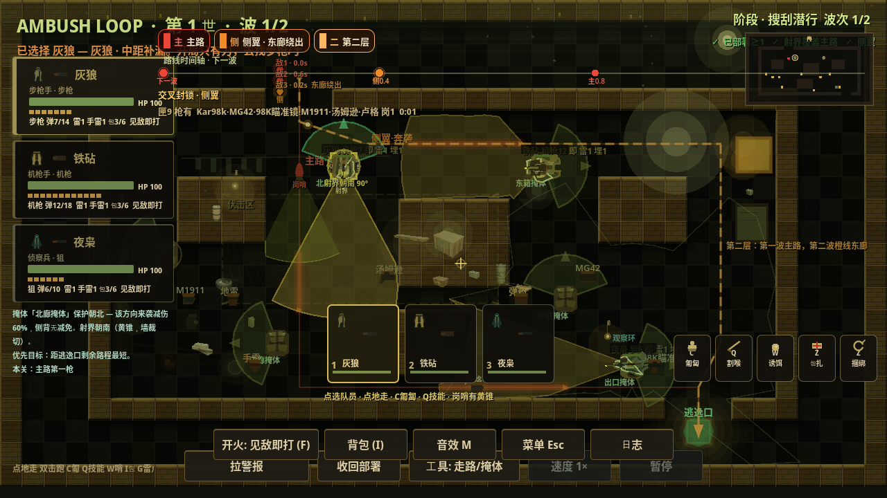
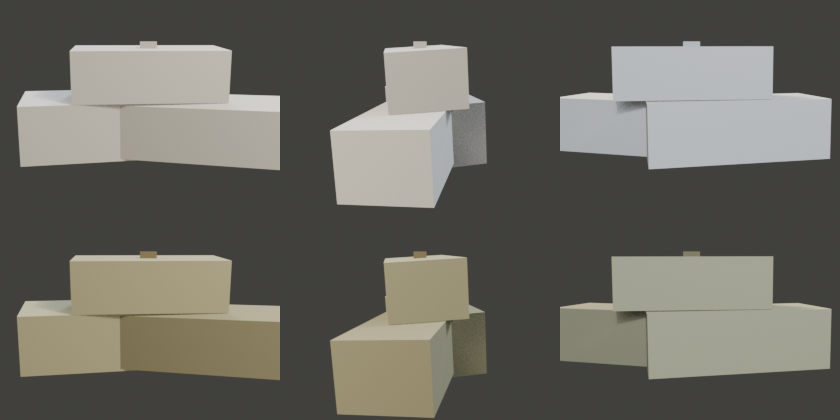

# Ambush Loop：可旋转写实场景与全面资产升级讨论稿

日期：2026-10-02（Asia/Shanghai）。状态：**用户方向已确认；资产盘点已完成；技术路线、预算与制作批次为待验证提案。尚未制作或接入本轮新资产。**

讨论入口：[Draft PR #14](https://github.com/hailinsu-create/ambush-loop/pull/14)。本 PR 保存讨论与盘点，不表示资产升级已经实现或验收。

源码基线：`c1aaf27c23f8f711f23305bf6f3223c38cb69098`。用户已要求合并的 [代码 PR #11](https://github.com/hailinsu-create/ambush-loop/pull/11) 与 [审计 PR #12](https://github.com/hailinsu-create/ambush-loop/pull/12) 均已合并，合并提交分别为 `fd34450`、`c1aaf27`。本讨论在新分支 `docs/asset-upgrade-20261002` 独立推进。

## 1. 已确认方向与规划替代关系

| 项目 | 本次用户明确选择 | 仍需样板决定 |
| --- | --- | --- |
| 视觉目标 | 更写实，接近经典战术游戏的厚重细节 | 色调、写实程度、镜头距离、实际手机上的细节密度 |
| 镜头 | 水平自由旋转 360°，俯角受限，可缩放 | 正交/弱透视、俯角上下限、缩放边界及手势 |
| 制作方式 | AI 辅助生成，统一修整和接入；可使用 Blender 或其他合适工具 | 按资产选择建模、材质、绑定、动画工具，不限定单一生成服务 |
| 环境 | 缺少的工具可按需在云端安装；确需用户配合时说明 | 外部服务账号、付费额度和目标手机若实际需要，再明确具体缺项 |
| 工作阶段 | 全面审视资产并讨论升级方案，建立新 PR | 批量生产以前，先用院子小样验证旋转、资产品质和性能 |

本补充**替代设计 v2 第 7.1 节的“镜头固定朝向、默认不旋转”要求**，并调整相关资产制作和镜头交互方向。v2 的六关、三人、安卓横屏、离线、SCOUT → ALERT → SWEEP、交火冻结计划、M0 真机及发行门槛继续有效。

“更写实”意味着可信的比例、结构、材质、光照和动作；整体仍应在手机战术视距下读得清。场景旋转涉及渲染、输入和展示架构迁移，需独立切片验证。高低地命中或寻路规则仍须独立 ADR，不能由模型高度暗中改变。

## 2. 当前资产与接入情况

可复跑的结构盘点：[scan_assets.py](evidence/asset-audit-20261002/scan_assets.py)；完整数据、引用及文件哈希：[inventory.json](evidence/asset-audit-20261002/inventory.json)。从仓库根运行：

```bash
python3 .cursor/docs/evidence/asset-audit-20261002/scan_assets.py
```

| 资产层 | 已核实的现状 | 升级判断 |
| --- | --- | --- |
| 3D 道具源 | `ArtSource` 有 14 个 GLB、14 个 `build_*.py` 与共用 Blender 工作室脚本 | 保留可复现制作方式；逐件评估造型复用，不能直接视为成品运行资产 |
| 运行图片 | `art/look` 有 13 张 256×256 PNG，全部被 `map_draw.gd` 引用，绘制在院子地标里；铁丝网仅有源资产 | 当前用的是固定角度烘焙图，GLB 没有被游戏脚本/场景直接引用 |
| GLB 结构 | 14 个模型共 9,400 三角面、424 个 primitive；均无纹理贴图与 UV 属性，均无骨骼/动画 | 现有常量材质有粗糙度/金属度，但缺少写实表面信息。统计按 mesh 定义相加，不代表实机 draw call |
| 主角、敌人 | 三名队员、四种现有敌人表现类型主要通过 `Polygon2D` 及程序部件/位移表现；未发现角色 3D 骨骼资产 | 建统一人体骨架、装备挂点和动作库；重建形体，保留角色及敌人逻辑 ID |
| 建筑与六关 | 墙地、地标、阴影主要由 `map_draw.gd` 绘制并缓存为 2D 纹理 | 需要完整的模块建筑、屋顶、内外墙、地面与各关标志物；不能只提高现有 PNG 分辨率 |
| 武器与工具 | 已有 10 种枪械数据；武器、手雷、地雷等主要为程序剪影/形状 | 统一持握比例，模型共用于手持、地面拾取与 UI 缩略图，保留数值和 ID |
| 特效与动画 | 已有枪口、命中、弹道、步态、倒地等程序效果 | 复用事件时机；为 3D 角色重建动作，补材质对应的命中与扬尘效果 |
| 声音 | `SfxBus.CUES` 有 45 个 cue；音乐/环境底音亦为程序生成；未发现入库的外部音频文件 | 保留 cue 接口和静音/后台行为，逐组替换为有质感的分层音效与环境声 |
| UI 与字体 | 主要是程序面板、图标、系统字体回退；没有随游戏入库的字体文件 | 统一图标、字体、面板和选中状态；重整层级，与 3D 画面一起看 |
| 制作管理 | 有源模型与脚本，未发现统一的逐资产交付/来源台账 | 每件资产记录源文件、导出物、用途、比例、材质、LOD、来源及验收状态 |

具体例子：`yard_crate` 612 三角面但拆成 51 个 primitive；`barbed_wire` 1,836 三角面却有 105 个 primitive。它们说明优化还需考虑物体/材质拆分，不能只看面数。沙袋目前只有 72 三角面，外形仍接近硬方块，缺少布料受压、塌陷、缝线与堆叠接触。

`ArtSource/README.md` 仍有“尚未接入”的早期说明，源码已显示 13 张渲染图实际接入院子。下一次管线变更应同步更新它，盘点以当前引用为准。

## 3. 画面观察与品质差距

本次打开并检查了合并进仓库的历史实机截图，以及木箱、沙袋、电台的源资产转面图。下图来自 PR #12 的实现提交 `989f8eb`，**不是本轮新运行截图，也不是旋转/3D 效果演示**。





| 观察来源 | 判断 | 优先处理 |
| --- | --- | --- |
| [院子准备](evidence/20261002/16_scout_yard_ref.png) | 墙、地、角色和信息叠层集中于黄绿暗色；平面网格占据画面，大量文字与射界竞争注意力 | 建筑真实厚度、地面大块材质、角色轮廓与照明；默认减少标签和多重射界 |
| [院子交火](evidence/20261002/17_alert_yard_w1.png) | 角色在实际战术尺度下依赖轮廓和标签辨认，画面难以表现可信的持枪与身体动作 | 三人不同装备轮廓、敌我形体区分、可辨认的瞄准/后坐/倒地动作 |
| [电台准备](evidence/20261002/30_scout_radio_empty.png) | 地标和颜色有差异，但仍共享明显的棋盘墙地语言 | 六关各有可从不同方向辨认的主地标及建筑/地面材质组合 |
| [木箱](../../ambush_loop/ArtSource/yard_crate_turnaround.png)、[沙袋](../../ambush_loop/ArtSource/sandbag_turnaround.png)、[电台](../../ambush_loop/ArtSource/field_radio_turnaround.png) | 基础轮廓可辨认；木材、布料、金属主要靠纯色区分，硬边和规则形体明显 | 结构可信、边角磨损、法线/粗糙度细节、合理接触阴影；每件验证 360° 外观 |

现状优点是交互对象、角色职责、六关主题、事件接口已经存在，升级可以围绕这些确定的用途制作。截图无法验证动作连续性、触控、音质、手机性能或模型背面几何完整性；这些保留为后续验证。

## 4. 推荐技术路线：3D 表现，复用战术逻辑

这是推荐方案，需通过第一批原型验证；用户确认的是旋转能力，尚未把某种实现当作已验收。

- 继续使用 Godot。建立 `Node3D` 场景、真实模型、`Camera3D` 与 2D HUD。现有六关布局、资源、路径与战斗时序尽量保留，由表现适配层读取逻辑位置/朝向/状态。
- 当前地图为 40×22、每格 32 个逻辑像素。集中定义逻辑二维位置与 3D X/Z 平面的双向转换，不逐处替换坐标；原始存档/回放格式先保留。世界 Y 表示展示高度，新的高点规则另行实现。
- 当前单位、射界和命令大量依赖 `Node2D` 与 `get_global_mouse_position()`，不能宣称是直接换一个 Camera。优先抽出选择、命令坐标、实体展示接口，再迁移一个院子切片，保持旧视图可作回归对照。
- 水平旋转围绕稳定焦点，俯角限制在战术可读区间，缩放有边界；暂以正交投影作为首个样板候选，同时小样比较弱透视。俯角、距离和单位换算均待原型定标。
- 镜头变化只影响观看。角色的世界朝向、冻结方案、敌人路线、命中和回放 tick 不随镜头变化；准备、交火、暂停、复盘都要覆盖。
- 点击使用摄像机射线，区分可选实体、地面与展示遮挡。装饰碰撞体、导航阻挡、战斗 LOS 分开建模；屋顶/墙变淡只解决观察，不改变子弹与寻路规则。
- 屋顶与可遮挡外墙按段独立，旋转后可遮挡淡出或切开；关键单位有克制轮廓提示。地面射界/路径跟随世界坐标，文字和 HUD 朝向屏幕，世界灯光不跟相机转动。
- 手机手势建议双指平移、捏合缩放、扭转旋转，并提供显式旋转与镜头复位入口；俯角使用独立控件或明确手势，避免与射界拖动混淆。UI 捕获的触摸不得向战场漏传，手势方案须实机验证。

旧固定角度 PNG 可保留作图标、比对图和旧视图资源；建筑、主要道具、角色的新版运行资产应有完整可见面。烟尘等效果可用合适的 billboard，不能把主要建筑和角色用单面图片交付。

## 5. 全面资产升级范围

| 类别 | 成套交付目标 | 第一批院子样板 |
| --- | --- | --- |
| 场景建筑 | 内外墙、墙角、门窗、屋顶、矮墙、围栏、台阶/坡道的模块套件；完整背面、遮挡拆分、简化碰撞 | 一段仓库建筑、可移除屋顶、围墙和可识别出入口；高台先作展示，不宣称已有高度收益 |
| 地面与地表 | 混凝土、泥土、砖石、金属路面；接缝、水渍、轮迹、植被和少量杂物 | 2–3 种主材质，有节制的磨损与潮湿变化，弱化棋盘观感 |
| 核心道具 | 整理现有 14 类道具；补交互补给、门、可用掩体、战术工具的统一模型 | 沙袋、补给箱、油桶、电台、灯具形成材质基准，装饰与可交互物可区分 |
| 三名队员 | 三个职责轮廓，共用骨骼规范；独立头盔/帽、背包、弹药携具与武器挂点 | 先做一名步枪手完整小样，再扩展机枪手与侦察兵；不能仅换颜色区分 |
| 敌人 | 对应现有巡逻/侧翼/潜行/回波类型，复用骨架并用装备与姿态区分 | 一名普通敌人，先验证与己方的远景区别，再扩展四类表现 |
| 武器与工具 | 对应已有 10 枪、刀、手雷、地雷/绊索、诱饵；统一握点、枪口、拾取模型与图标 | 步枪、机枪、精准武器三种轮廓；不调整伤害、射程或弹药 |
| 动画 | 待机、步行、跑动、蹲伏、拿取、部署、瞄准、射击、受击、死亡；拖拽等已有动作单列 | 步枪手至少待机/移动/瞄准/射击/拿取/死亡闭环，动画由模拟状态驱动 |
| 战斗特效 | 枪口火光、烟、弹壳、材质命中、爆炸、脚步扬尘、倒地反馈 | 开火→命中→死亡的短流程，与真实结算对齐，暂停/倍速/重试不留旧效果 |
| 光照与氛围 | 冷色环境光与局部暖灯、真实接地、受控雾与环境动效；每关独立气氛 | 暮色院子，近处角色与可走区域可读；不会因写实而把阴影压成黑块 |
| UI 与表现图 | 字体、角色头像、武器/工具图标、面板、按钮状态、指示标记、标题与结算 | 顶部简洁目标、底部三人卡、单一主操作；修复 720p 结算可达性，战术细节按需展开 |
| 音频 | 45 个 cue 逐项映射，枪声分层、脚步材质、装备摩擦、拾取/开箱、环境与结果反馈 | 三类武器、基础脚步与交互、院子环境声；保留音乐/SFX/静音/后台接口 |
| 六关标志物 | 院子仓库、仓道棚架、泵站设备、信号楼桅杆、油库罐群、电台天线 | 样板通过后再按关卡扩充，在不同观察方向仍能辨认；首批不并行铺满六关 |

声音也属于厚重感的一部分。此轮只核对生成代码与 cue 清单，未做实际耳听；不能把“45 个 cue 存在”当作声音品质合格。

## 6. 制作流程与运行规范

### 工具分工

Blender 负责最终可编辑的几何、UV、材质、绑定、动画、LOD 与导出。规则建筑、模块道具优先用可复现脚本或可维护建模流程；有机形体采用适合的雕刻/建模方法，避免把布袋、服装继续拼成硬盒。

AI 用于方向参考、角色/道具设计、多视图辅助及纹理/模型初稿；输出必须经过统一比例、结构检查、材质整理与动画测试。不会把多张生成图片之间不一致的背包、枪身或衣服结构直接作为一套资产。是否采用外部 3D 生成服务按实测结果决定，Meshy 不再是角色制作的前置条件。

源资产与游戏导出物分开。延续现有道具脚本的可复现约定；复杂角色若需要原生编辑文件，应同时交付规范化源文件、依赖清单与批处理导出脚本，并在独立管线切片中明确调整旧规则。概念图、未清理高模、可运行模型、已验收资产分开标记。

### 每件运行资产的交付要求

- **结构**：完整可见面、正确法线、无不合理穿插；清楚的尺寸、地面原点、朝向；门、箱盖、武器、角色骨架等按实际运动需求拆分。
- **材质**：按项目统一的基础色、法线、粗糙度、金属度及必要 AO 流程；不要把方向性高光/阴影画死在基础色。先用共享材质、trim sheet 与图集控制重复度。
- **导出**：GLB 与可追溯源文件，材质/纹理完整；移动端需要 Mipmap、压缩、LOD、合理 surface 数及实例复用。准确数值由目标机测试决定。
- **动画**：共用骨骼命名与握持/枪口挂点；位移服从原战术模拟，首批使用原地动作，禁止 root motion 暗中改变速度或终点。
- **分类**：每件标记装饰、阻挡、掩体或交互；视觉网格不能自动变成战斗规则。展示遮挡体与命中/路径结构具有明确映射。
- **登记**：资产 ID、用途、源文件、工具/版本、来源/使用条件、加工记录、导出哈希、三角面/surface/纹理统计、测试场景及当前状态。
- **验收**：八个水平观察方向、俯角上下限、最近与最远缩放；模型转台和实际 Godot 场景都要检查。转台渲染只证明资产外观，不能替代游戏验证。

纹理尺寸与面数不能按“全部 4K”统一堆高。先以角色/主要道具/背景分档，小物件复用材质，分别记录 CPU/GPU 帧时间、显存、draw call、加载时间与 APK 增量。最低目标手机和帧率档位尚待确定，不提前承诺 60 FPS。

## 7. 建议执行顺序与退出门

| 顺序 | 独立切片 | 必须拿到的结果 |
| --- | --- | --- |
| A0 | 旋转与输入灰盒 | 院子简模、逻辑坐标适配、360°/俯角/缩放、选中/移动/射界/屋顶遮挡；转镜头前后同一命令和模拟结果一致 |
| A1 | 写实资产基准 | 5 类材质道具、一个建筑片段、步枪手和敌人小样；完整转台，远近可读，导出与重新导入可重复 |
| A2 | 院子完整体验样板 | 三人、院子主建筑/地面、首批动作/特效/声音、新 HUD；SCOUT → ALERT → SWEEP 与结算闭环，实际录屏展示旋转 |
| A3 | 手机与规模验证 | 两档目标设备/图形设置，长时间稳定运行、不同镜头方向的开销、触控不串操作；性能证据对应源码与资产版本 |
| A4 | 六关扩充 | 通过复用套件逐关补充地标、材质和声景；保留各关两种有效方案与失败反例，不把复制摆件当作关卡完成 |

A0 先验证技术和交互，A1 再建立品质标准，A2 才把它们合成可玩样板。A0 与 A1 可以研究迭代，但首轮不同时改六关、重写战斗和批量生成所有模型。

关键反例：镜头转到 90°/180°/270° 后点击同一地面格与单位；旋转时角色世界朝向保持；门开关后预览与 LOS 一致；墙淡出后子弹仍按原墙规则阻挡；旋转手势取消不落下一次移动命令；ALERT 镜头自由但布置仍冻结；暂停/倍速/复盘仍读取同一模拟状态；1280×720 和手机安全区内主按钮可达。

## 8. 当前交付边界与下一步讨论

本轮完成：两个旧 PR 合并并核对远端、源资产与引用盘点、六张归档图片检查、用户方向记录、独立讨论分支/PR。当前环境检测到 Blender 4.3.2 和 FFmpeg；默认 Godot 为 4.6.3，项目固定版本为 4.7.2，正式原型验证前需补齐匹配版本。未用不同版本冒充游戏测试通过。

本轮未完成：新模型/纹理/音频、3D 运行场景、旋转镜头、手机触控/性能、声音耳听、M0 真机闭环。网页 GPT PLAN/REVIEW 为 unavailable，没有外部 approve。

下一步以 A0 的可旋转院子灰盒和 A1 的资产基准为起点。需要继续讨论的具体问题是：院子的昼夜与光照基调、镜头正交/弱透视的实际观感，以及最低目标手机。工具选择与常规安装按已授权范围自行推进；涉及外部账号或费用时说明具体需求。
