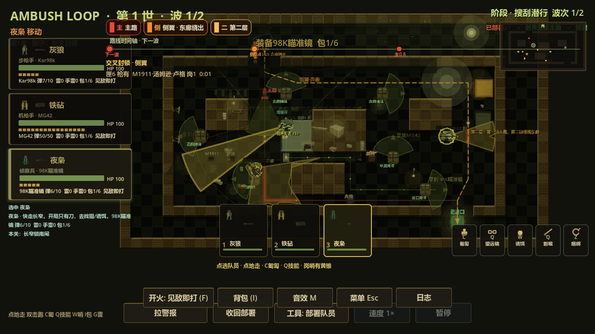
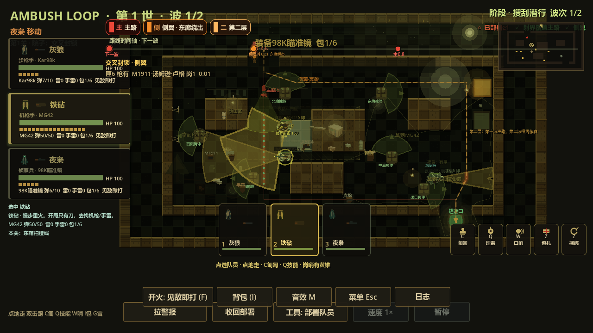
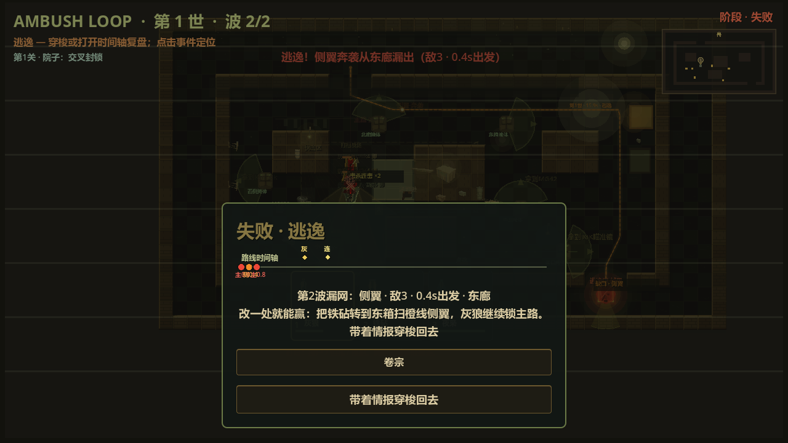
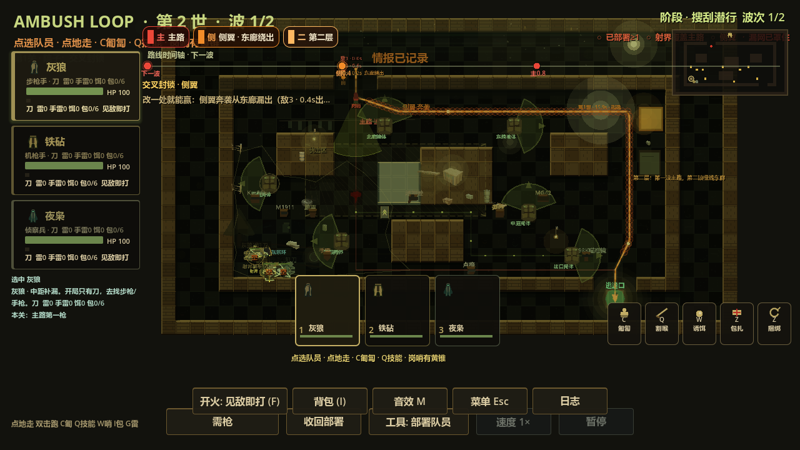

# M1-I 院子桌面渲染可读性与战术差异证据

日期：2026-10-03。承接 H 整关一致性 gate 与 M1 D–I 桌面续做路线。此阶段只做原项目桌面渲染、截图与目视核对，不重做美术，不代表 Android/vivo 或真人试玩验收。

## 目标与画面

使用 Godot 4.7.2 图形 renderer 在新鲜隔离用户数据目录中渲染真实 `main.tscn`/yard，并保存未裁切 PNG：

1. **A 有效方案：** op3 精准手经坡道占高台，op2 支援手补主路，op1 步枪手封侧巷；显示选中队员的青色离散覆盖、红/橙色路线/全队覆盖参考、逃逸标记及仍在场的可选资源点。
2. **B 有效方案：** op2 支援手经坡道占高台，op3 看出口，op1 护台阶；以相同武器/弹药状态展示与 A 可辨的角色、位置及火力扇区差异。
3. **失败与重试：** 三人集中主路、东廊 flank 真实逃逸后的失败结果画面；再截取正式 Continue 之后的 SETUP/库存与补给恢复画面。

至少核对：坡道平台入口及上下关系、主路/东廊/逃逸标记、队员与路线覆盖、剩余资源点、A/B 站位差异；C3 青色离散目标点与旧黄色火力扇形、橙色全队覆盖线颜色/语义不混淆。无清晰证据时可修正测试相机 framing 或渲染捕获稳定性；不改平衡/伤害，不以自动截图代替五人首局理解验证。

## 可复验要求

- 新增 `m1_yard_visual_evidence_gate.gd`，经现有隔离 runner；唯一渲染模式同时仅放行 C3 gate 和本 I gate。
- 每张图片记录绝对文件路径、尺寸、bytes 与独立 run ID；必须从实际 viewport texture 保存，非 mock、线框草图或既有图片。
- 图片交付到规划仓库 `.cursor/docs/evidence/m1-i/` 并由此规划 PR 保存；目视逐张查看，画面未达到上述检查表时修正捕获或布局后重跑并替换结果。
- 隔离 runner exit 0 且 `PLAYER_DATA_UNCHANGED=1`。仅渲染 gate 变更不改生产代码；最终仍复跑完整 smoke 与本轮 D–H 相关栈。

## 边界

这组桌面截图证明的是当前桌面 renderer 的可读性，不证明 vivo Fold2 显示比例、触控可达性、性能/热稳定性、音频根因修复或新玩家无需帮助的理解度。外部 GPT 对本轮精确差异的新 REVIEW 仍待后续授权；不得把历史 PLAN/REVIEW 记作 I 批准。

## M1-I 实现与目视结果（2026-10-03）

- 源码分支：`codex/m1-i-visual-evidence`；代码只增加可视化证据 gate 和隔离 runner 的精确入口，不修改生产玩法。
- Godot 4.7.2 图形渲染隔离 run `81ca8c1b0c5e45e395cacc3366b103e0`：exit 0、标记 `M1_YARD_VISUAL_EVIDENCE_OK plan_a=1 plan_b=1 real_flank_failure=1 retry_setup=1 screenshots=4`，并确认 `PLAYER_DATA_UNCHANGED=1`。
- 四张 PNG 均从实际 viewport 捕获，分辨率 1280×720；已逐张目视检查：A 有效方案 275,411 bytes，B 有效方案 273,202 bytes，真实侧翼失败 176,252 bytes，Continue 后重试准备态 277,219 bytes。

目视检查确认坡道/平台、主路与东廊逃逸、队员路线与覆盖、剩余补给点和 A/B 站位差异均可辨；青色离散覆盖与黄色扇形/橙色参考覆盖没有混淆。失败图来自真实 flank 逃逸结果，重试图来自实际 Continue 流程，不是静态伪造状态。

**共享回归：** D–H 单项隔离 gate 与 I 渲染 gate 全部通过；D–H 后接的全量 `smoke_test.gd` 隔离 run `6aa4327b890741a89270cdea56124d60` 完成，包含 yard、warehouse、pump、railcut、depot、radio 六关循环，出现 `SMOKE_SLICE_COMPLETE`，runner exit 0 且 `PLAYER_DATA_UNCHANGED=1`。外部 GPT 新精确差异 REVIEW、Android/vivo、五人试玩和设备依赖 AudioTrack 仍按用户要求暂缓。

状态：D–I 自动化桌面开发和共享 smoke 全部完成；M1 整体仍等待明确列出的人工/设备验收，不把暂缓事项标成完成。
