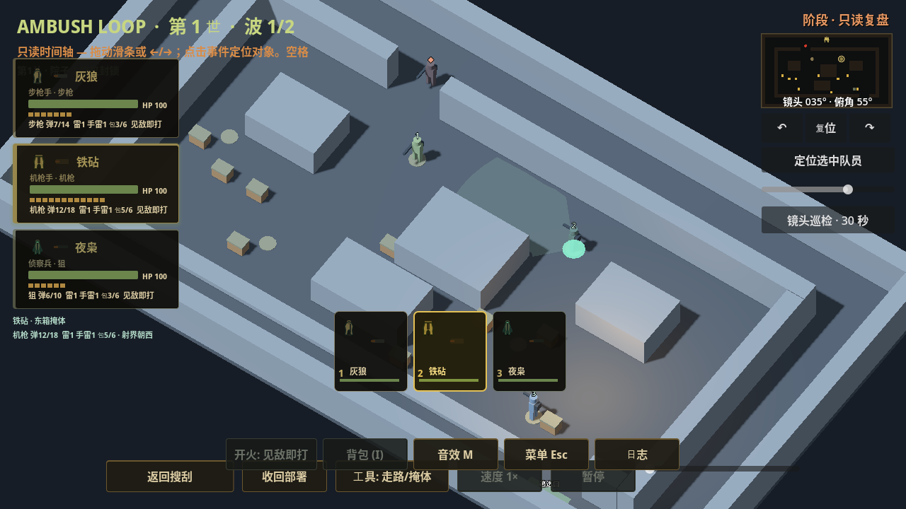

# PR15 C2Help 历史隔离补片

日期：2026-10-02。运行源码 `cf61721fdb84a3bd9376049d0547e3d74bb26833`。来自dot对744cb的独立复验：原头像/队员卡的历史M1911与当前knife P2已关闭；新增桌面C2Help仍保留实时打扫/换枪或合法望远镜提示。独立QA结果为其实际10项/2fail/退出1，不能用其他HUD通过掩盖。

## 实际反例与修复

本作者在18dc381生产代码上加入隔离专用复现驱动，1280×720真实yard_3d，准备[1,2,5]三掩体，真实ALERT→SWEEP（306tick），桌面自然打扫提示visible，控制条件true。进入REPLAY后提示仍可见；返回真实SCOUT并合法使用望远镜，名字LIVE_ONLY_SCOUT产生live提示，binoculars_t>0且控制条件true，重新查看独立保存的上一份历史同样泄漏。驱动不把旧事件绑定当前run_id。正式基线30项/16fail/退出1，含布局/迟到提示/旧与未知记录/退出分支；不是夹具错误退出2。

修改仅在C2Director提示层：REPLAY布局和轻刷新均隐藏并清空help_chip；进入/刷新历史停止旧hint Tween并复位alpha。_hint在REPLAY拒绝live写入，避免迟到技能/岗哨提示覆盖历史status或手机提示。退出恢复原有chrome，SCOUT重置重新生成当前阶段帮助，不恢复陈旧提示。新提示只持有一个Tween，替换时停止上一条。没有修改模拟或装备冻结规则，没有只替换特定文字字符串。

WON/FAILED退出由显式phase fixture验证现有退出/重置函数，未称本测试完整战斗达成胜利/失败。实际自然SWEEP和合法SCOUT望远镜入口另有控制证明；部分/未知历史、手机/桌面反复布局和迟到写入都覆盖。旧基线开发版因保存的BattleLog被_setup清空导致结果fixture失真，已修复为每次独立普通值副本，重跑正式基线；旧开发日志留证不计正式反例。

## 验证证据

[机器证据](evidence/20261002-pr15-c2-history-hint/validation.json)已保存固定源码、实际命令/退出码、run_id、marker和日志/截图hash。`timeout 300 bash ambush_loop/scripts/run_isolated_test.sh /workspace/.ambush-loop-env/bin/godot-capture c2_history_hint_test.gd --render`：30项退出0，run e98857ea8ecf4322b0a10d585f2edf22；同包装器 visual_snapshot_test.gd（timeout600）：164项退出0，run966845e4092c4dd496183f35913fe6e4；presentation_lifecycle_test.gd（timeout300）：32项退出0，run b0ee0caa6c5442e4bd590e5c575d58d2。三份正式日志无脚本/资源/泄漏错误；只见软件驱动VSync告警。截图实际查看，C2Help无旧live文本，历史夜枭头像正常，仍是灰盒战场。

Godot4.7.2隔离包装器与StorageGuard、Compatibility软件Mesa；不能作为设备性能或美术验收。dot已独立复验关闭本片P2，无新确定P1/P2：原SWEEP/望远镜10case旧2fail新全pass，扩展hint84、真实ALERT/SWEEP/FAILED/两波WON退出41pass，重跑hint30/HUD164/lifecycle32pass，查看新旧3D软件图。该独立范围未包含974的campaign/smoke/设备或R3战場；来源为dot本轮固定974复验反馈。

下一步按 [R3战场计划](AMBUSH_PR15_R3_RUNTIME_20261002.md) 接入实际角色历史时钟/动作/LOD，然后音频唯一持续层与环境候选。R3资产层技术测试与本C2补片的HUD回归分开，不借用旧固定SHA结果。全计划仍未完成，最新完整smoke仍7d34867；Windows包装器未执行，GPT PLAN/REVIEW unavailable。
