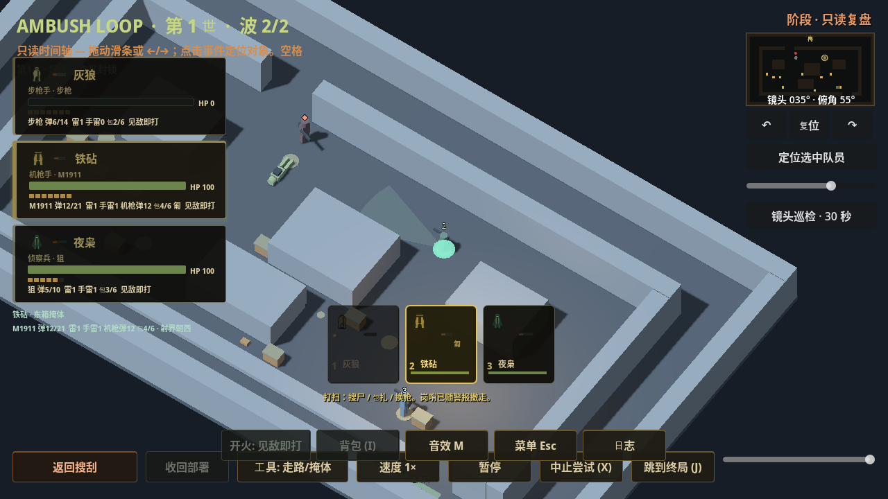
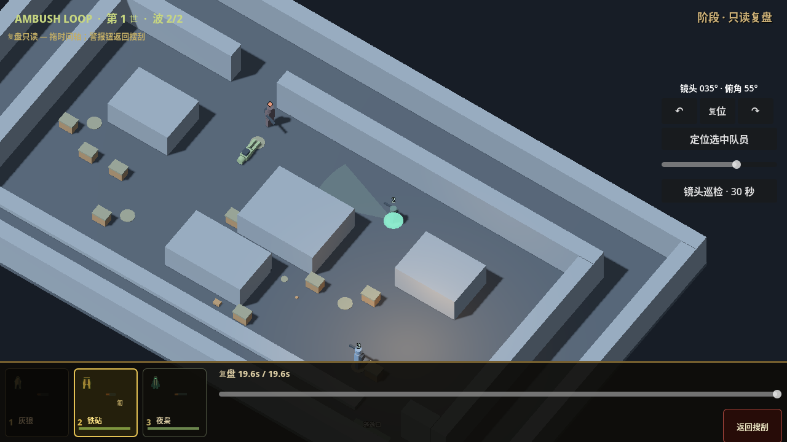

# PR15 历史队员HUD与手机回放时间轴

日期：2026-10-02。核心代码切片 `a93269474a8f7d29b290fa9514306b3333e126e3`，在授权PR15分支独立提交并核对远端；Draft/Open，未merge。另有UI清理切片 `ed673ed6e13498c7cb466634aacb4758daec6917`，清除进入回放前的活体短横幅/plate、把手机只读提示移到记录标题下方；不混淆两个源码的验证范围。继承4dea的四项P2修复，不改模拟、伤害、资源或高度玩法。

## 问题与行为

独立QA在4dea复验仍确认：历史M1911帧的头像和左卡会读当前knife；历史HUD检查因此退出1，不能用其余测试通过掩盖。本片为回放记录增加可选 `hud_schema:1`，复制关卡标题、世数/波数、名字、角色/装备显示名、背包文本、开火策略、HP/弹药容量、跟随和掩体名称。记录只有普通值，与活体解耦；格式1已有装备/姿态/工具/环境字段保留。

`HudRecord`为左卡、C2头像和选中单位读数提供历史字段/中性缺省。HP在seek时立即切换；清除卡片残留开火/受伤脉冲；历史头像禁用选择/跟随/双击定位活体，历史小地图不持有当前host/grid。摄像机仍可围绕记录位置观察，不能借当前队员位置定位。旧部分记录使用“队员1/装备未记录/背包未记录/历史关卡/—”，缺容量时隐藏容量条；未知视觉格式清除旧卡/地图演员且保留原记录。

桌面和手机都能从主按钮返回搜刮并恢复实时卡片/小地图绑定。手机旧桌面栏隐藏了scrub slider；现提供独立只读HSlider及历史秒数，REPLAY只显示返回按钮，隐藏布置命令。原生ScreenTouch在20%和80%位置前后跳转；不修改被故意污染的活体。

## 验证范围

固定4.7.2，隔离包装器随机XDG+StorageGuard。测试先真实通过首波SWEEP换M1911/匍匐/关闭自动雷再进入第二波，然后将当前MG改成knife、名字LIVE_ONLY、HP3、弹药0、STAND/HOLD策略，关卡标题LIVE_LEVEL、世数+90，并污染位置、背包、地图等。往返第一/第二波历史帧验证记录字段、只读界面及活体/模拟保留；旧/未知格式和返回操作另验。合成gui_input双击仅证明接口守卫；手机slider为真正Input.parse_input_event→GUI原生触控。

固定源码正式结果与完整命令、随机run_id、退出码、完成标记及日志/PNG哈希见 [证据索引](evidence/20261002-pr15-history-hud/validation.json)。a932核心的历史渲染162、时间66、表现合同84039、生命周期32、工具入口/原生旋转35和六关完整多波10296均退出0。装备冻结首次240s退出124，无完成标记；900s重跑66项退出0，实际launch为92d2bc4，只有规划文档新增，ambush_loop源码树与a932完全相同并已用git diff退出0核对。超时日志保留，不计通过。

开发阶段首次HUD脚本有类型推断解析错误，尽管断言输出131项/进程0，日志含SCRIPT ERROR，已判失败并保存。修复显式Dictionary类型后重新验证；正式日志逐份检查资源/脚本错误。软件渲染只存在驱动不支持VSync切换告警，不作为设备性能。

ed673ed小UI清理正式跑 `timeout 240 bash ambush_loop/scripts/run_isolated_test.sh /workspace/.ambush-loop-env/bin/godot-capture visual_snapshot_test.gd --render`，164项退出0、run `bc89b1d857df4b1f82307e71d964b2f1`；同包装器的 `presentation_lifecycle_test.gd --render` 32项退出0、run `00ad55a6202b4b9bab51e8278126520b`。两者无脚本/资源/泄漏错误。下列图片与哈希均来自ed673ed最新运行；a932的七项回归不归到后续源码，未无理由重复整场回归。

两图实际查看，仍为灰盒战场。本片验证指定历史字段和控制恢复；完整战场资产、历史事件提示/FX/动作回放和成品HUD布局另验，不以截图声称完整A2/设备性能或整个计划完成。未复跑约18分钟完整smoke；最近完整smoke仍是7d34867固定副本，不能归到a932/ed673ed。

## 下一片与独立资产接口

R2 `812261a0d7c29446ab631108feec5389cec2950b`仍未迁入，下一片按新catalog_candidate替代R1台账，逐文件采用已审候选，验证共同骨/动作/挂点与LOD。禁止拿旧actors_manifest的R1哈希验新R2文件。最终美术、其他枪族专用握持、动作自然度仍待验。

独立音频355ea89/验证源码86df6d0已fetch并完整读取README；只交新audio_v2目录，暂无范围外diff。本作者未迁入、改源或运行生成器。45项技术导入/绑定未调用play，听验0/45、0/6；七loop的.wav.import显式[0,352800)必须保留，持续层不得与旧mood/一次性cue叠放。后续实测推荐gain、10voices分类限额、真实播放与生命周期、回放事件身份/去重和六关战场混音；技术导入不称运行音频完成。[已推音频接口](AMBUSH_PR15_AUDIO_INTERFACE_20261002.md)。

另提出供dot分配的 [完整环境资产独立包](AMBUSH_PR15_ENVIRONMENT_INTERFACE_20261002.md)：新environment_v2目录、建筑/地表、14类原用途和五关地标；不编辑既有yard/actor/audio共享输出和main。尚未派遣生产。

后续仍为角色/装备动作→完整yard/HUD/3D回放→A3云端优化→其他五关完整接入→可追溯APK；完成全部制作和云端验证后才讨论模拟器/真机。网页GPT PLAN/REVIEW unavailable，无外部approve。
