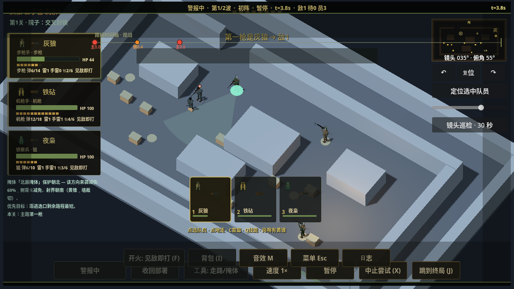
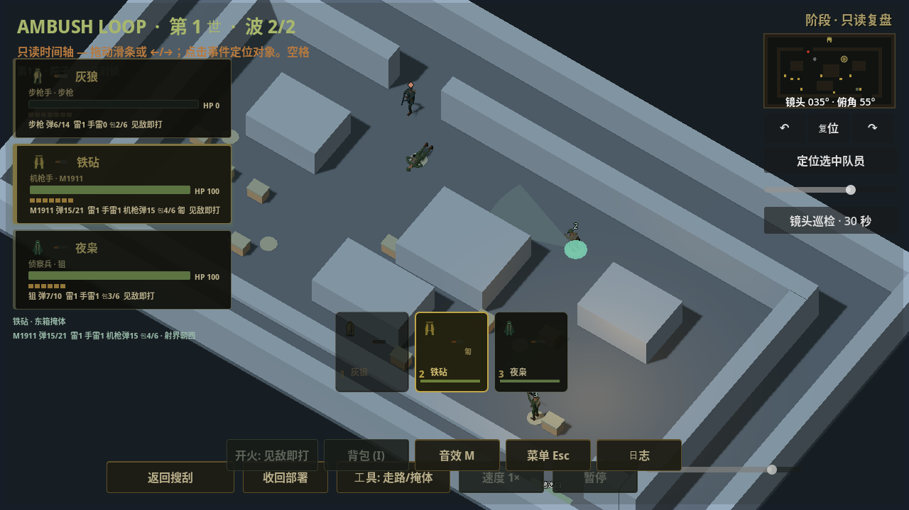
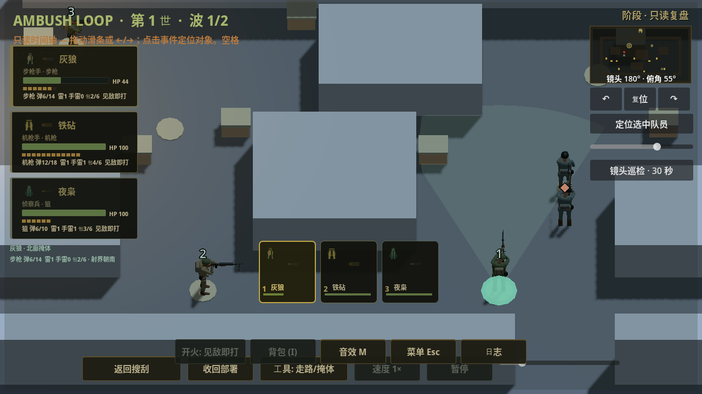

# PR15 R3 实战角色与历史动作主路径

日期2026-10-02。运行源码 `e7b8cfa44bc306c31286e98bff2c2c8957471beb`；测试类引用修正 `f47f3213331c3ffec88e708f1a0782e4f2ad1435`。两提交已推送并核对远端，Draft/Open/未合并。f47仅修改visual_snapshot_test，ambush_loop其余源码diff退出0；下表按实际launch SHA分开。R3仍来自00b2708/8a1fbe9，51GLB/3PNG未改。替代上一技术接收报告中“presenter仍灰盒”的当前状态；历史技术证据保持原范围。

## 主路径变化

真实yard_3d presenter现在把三队员、敌人和SCOUT岗哨换为导入的R3骨骼Body；世界建筑/道具仍灰盒。脚底位置/朝向由只读ViewState提供，根不缩放，不加碰撞、导航、LOS或高度机制。队员使用记录的角色与实际装备映射，EnemyRunner没有命名枪械机制，敌人武器是明确记录的视觉道具，不能作为新增模拟装备/伤害规则。

视觉格式1继续兼容，新增独立可选animation_schema1、actor_asset_revision固定R3源、visual_model/visual_weapon、pose_clock_s及simulation/command域。ALERT用BattleLog全局tick/60；暂停墙钟不动骨姿，2×增加模拟步而非自动AnimationPlayer。SCOUT/SWEEP取现有命令阶段时钟，历史帧复制该值；历史ALERT在两快照间按全局tick差取样，不借活体补值。

ActorPose是纯帧函数：循环动作由记录时钟采样，射击/死亡按相同schema2/attempt/wave、已发生且actor匹配的事件与stable event_id取时间；不把旧事件挂到当前run_id，不用未来death/fire，不以事件修改HP。死亡只在记录alive=false时显示；匍匐优先，不用站立fire冒充尚缺crouch-fire overlay。搜箱按记录search_t取pickup。R3 haul是弹包carry，真实拖尸明确用中性动作回退，未称拖尸完整。hit/deploy及新刀刺/投掷等命令动作、自然过渡仍待后续接线。

缺动画格式、未知格式/资产revision和非有限时钟使用简化Body，保留历史HUD与原数据并给出中性提示。角色缓存按level/attempt/wave/replay/动画支持边界清理。近/中/远LOD0/1/2使用投影视口尺寸和滞回；更换保留动作/装备/根/枪口，不更换逻辑对象。BoneAttachment原来延迟到下一渲染帧才更新，现手动采样后同步实际attachment transform，同一帧seek/LOD即可读正确枪口。

## 实际发现的旧表现写入

开发真实ALERT暂停与REPLAY渲染比较各失败一次，诊断显示敌人逻辑pos被既有enemy._play_death_fx Tween沿最后移动方向推8px：暂停前(432,360.8995)→(432,368.8995)，骨姿本身不变；回放前后另一尸体根同样漂移。该Tween与R3无关，旧代码确实tween_property(self,global_position)。本片移除根位移，保留body旋转/压扁/淡出，尸体逻辑锚点稳定；未改存活移动、射击/伤害或掉落触发。六关原有事件/结局不变量回归另证。

## 固定源码验证

[完整机器证据](evidence/20261002-pr15-r3-battle/validation.json)保存实际命令、退出码、run_id、日志、截图及哈希。Godot4.7.2；所有正式结果退出0，无脚本/资源/泄漏错误。Compatibility llvmpipe只有VSync驱动告警，不证明安卓性能。

| 实际源码 | 包装器入口与模式 | 检查 |
| --- | --- | --- |
| e7b8cfa | actor_battle_test.gd --render，timeout900 | 231 |
| e7b8cfa | presentation_contract_test.gd headless，timeout900 | 84039 |
| e7b8cfa | campaign_replay_test.gd headless，timeout900 | 10296 |
| f47f321 | visual_snapshot_test.gd --render，timeout900 | 164 |
| f47f321 | replay_timeline_test.gd headless，timeout300 | 66 |
| f47f321 | equipment_freeze_test.gd headless，timeout900 | 66 |
| f47f321 | actor_visual_test.gd --render，timeout600 | 4362 |
| f47f321 | presentation_lifecycle_test.gd --render，timeout600 | 32 |

真实战場测试先SCOUT→ALERT产生实际射击→暂停4帧/墙钟→实际2×帧→首波SWEEP合法换M1911/匍匐→完整第二波→WON提取，再污染当前MG为knife/站立/HP3/位置(32,32)/runID+200，前后seek两波。实际骨/挂点/枪轴、脚底、暂停时钟、同帧LOD枪口、未来射击/其他attempt-wave拒绝、精确骨姿复现、旧/未知格式和新attempt均检查；源记录和被污染活体保持。M1911为事先明确的视觉装备fixture，战后只消费authored loot，未补额外战斗弹药。

六关完整多波包含static60/rotate30/rotate60@2×三变体，yard2波终tick1283/34events，warehouse2波1191/67，pump2波907/34，railcut2波719/38，depot2波957/35，radio3波1413/51，结局/事件/记录时间等价。仅角色路径推广到六关；不是六关环境成品视觉通过。

开发日志保留：首次presenter pixels类型推断解析失败后主动终止130；挂点/旧根漂移失败日志1；214项中旧根漂移2fail退出1；首次HUD新断言is preload语法错误退出1，经f47命名类修正后正式164通过。失败/解析错误不计通过。独立完整smoke最近仍7d34867，没有归到本片；Windows包装器未执行。

八张实际战场捕获有固定e7哈希，本作者查看SCOUT、ALERT、历史近距和第二波四张；其他捕获未逐图验收。画面可看到真实模型及历史M1911/匍匐/阵亡，但建筑是灰盒，旧HUD密集、近脸/其他枪左手接触和动作自然度仍待。不能据此声称完整A1.2/A2或最终美术。

## 后续执行与接收接口

继续完整v2，不停在资源fixture。下一片按既有音频接口采用355ea89的45WAV/45显式import及主作者运行台账，不整体打包audition/evidence或重跑生成器；短声按8voice分类限额和推荐gain，七loop进入唯一ambient/bed持有者，避免旧mood/once-cue叠放，真实play与暂停/静音/后台/标题/换关/REPLAY生命周期及六关混音另验。听验仍0/45、0/6，未当作通过。

R4候选资产194d9c41aaddbf014f05c70c14d40c09e6d8131b/交付c4c21708a2e06d3a7eaefbb8ab6bfeee31f5073d已登记待读取/接入：20骨12原clip/socket兼容，40可选clip及3枪接触marker由独立作者制作；runtime family overlay、连发/cancel/换枪/upperbody mask、历史身份与时钟由本作者负责。reload是姿态，不新增装填机制；旧R3记录不能无验证地借新姿态版本。刀刺/投雷/诱饵/拖拽动作仍由该作者继续，不能把本片回退称完整。

环境交付9c06f04cf7795faf69d9d69d0f853f30ccf80838（制作50ef7883285c4419dbd8339b935433dc6bb5e3f8）HANDOFF已完整读取；按85最小运行文件+11旧依赖核对，展场是12×12不是40×22战场。后续接loader/总manifest、六关布局、箱盖/门/loot、遮挡与运行LOD；35度门框/屋顶遮挡和旧油桶/电台材质差异必须处理，样本/evidence不整体装玩家包。3519资产图分版本重捕，不能写同最终SHA整套视觉通过。源制作独立单写者，反馈经dot转交。

完成角色/装备动作、完整yard/HUD/3D回放、A3云端优化、其余五关完整环境和可追溯APK后再讨论模拟器/真机。当前没有代码执行阻塞；资产最终接受/听验是仍需独立审查的质量门。GPT PLAN/REVIEW unavailable，无虚构approve。
