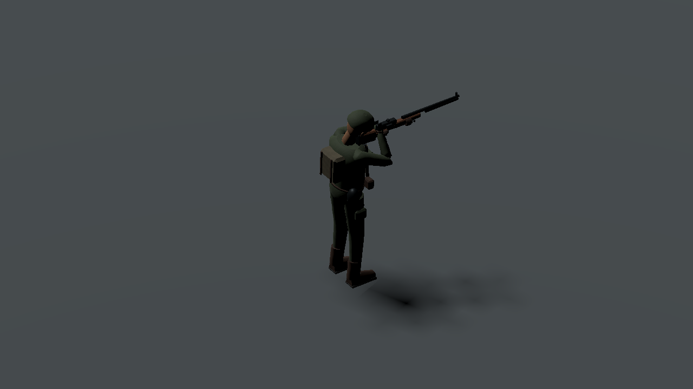
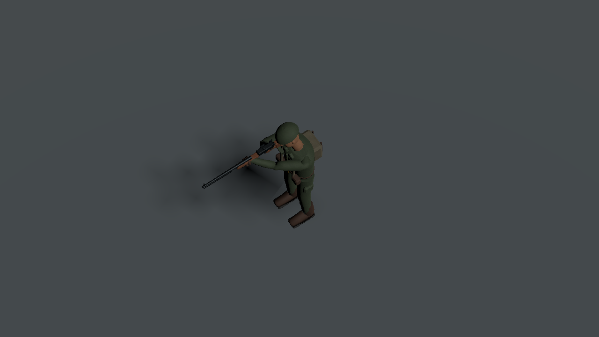

# PR15 R3 台账与显式骨骼取样技术接收

日期：2026-10-02。固定运行源码 `18dc381c04428a77b762b9fdb5fd1880beb45a2c`，已推送并核对 PR15 Draft/Open/未合并。资产制作源码 `00b270863ba5a2cd5425abf2a31e78965c72ae45`，候选证据 `8a1fbe98e4f00ea5209c38d4e0749b1f992f9326`。本片替代 R2 的尚未迁入候选以及 R1 静态运行台账；旧验证留在历史报告，不能用旧 hash 证明 R3。

## 实施范围

按候选逐文件原字节复制 51 GLB / 3 PNG，注册七角色三 LOD、十五装备双 LOD。运行台账 `art/v2/actors_manifest.json` 记录 schema2、候选源和证据、实际预算/骨/动作/挂点与明确的技术接收状态。loader 同时读取 yard schema1 和 actor schema2，拒绝未知资产/LOD，独立材质缓存和外部 atlas 保持。未整体合并候选分支，未复制、修改或重跑 build_actors、Blender 源、yard_kit 生成器；旧 yard 资产和生产源 diff 为零。

新增 `presentation/actor_visual.gd` 是无 host/模拟/时钟引用的 Node3D。AnimationPlayer 设为 MANUAL，由调用者提供动作和秒数；循环动作用显式取模，单次动作 clamp，未知动作/非有限时间拒绝，不改共享动画资源。LOD 更换保留根变换、装备、动作与采样时间。枪/工具挂在实际 hand.R 骨，通过实际 grip marker 校正；枪口读真实导入节点。R3 mine grip Y=.075、eye Z=-.106 从候选记录读取。角色动作/LOD 实例本身没有碰撞或导航。

本片仅注册资产与技术呈现接口。presenter 仍使用原灰盒，不声称战场、全 3D 历史动画或 A1.2 最终美术完成；R3 haul 是弹包 carry，不能冒充拖尸。

## 固定源码验证

完整命令、run_id、日志哈希、54 件运行文件哈希与 16 张捕获记录见 [机器证据](evidence/20261002-pr15-r3-runtime/validation.json)。Godot 4.7.2 / Compatibility / 云端软件 Mesa，实际结果：

| 项目 | 实际结果 | 层级 |
| --- | --- | --- |
| 隔离 editor import | 退出0，无脚本/资源错误 | 导入 |
| actor_visual_test --render | 4362 项，退出0 | 21 个角色导入实例真实20骨/skin bind一致、12clip五时点取样、无root motion；M1指定握持/枪轴、挂点、暂停不自动前进、LOD和四种收枪 |
| asset_library_test --render | 273 项，15装备/30LOD，退出0 | 静态夹具、当前R3 hash和真实导入marker |
| Linux Desktop export-pack | 退出0 | 资源打包 |
| 空物理工程目录 PCK probe | 329 项，退出0 | 全51GLB、3纹理、台账、21角色骨和12clip实际加载 |
| 固定候选只读二进制复核 | 22资产/51LOD、0违规，退出0 | 未重跑生产生成器 |

包 `/tmp/pr15-r3-18dc381.pck` 为 12,593,248 bytes，SHA-256 `f32dde01d3906c0ccce265d85d1f44ee524b095e018e600f4f319a7359fd81f2`。这是技术 PCK，不是 APK。16 张八方向×两俯角捕获均有哈希，本作者实际看了下列两张；其余不能写为逐图品质验收。

这些图是角色层夹具。其他枪族专用握持/动作过渡、近脸品质、脚底与武器在完整战场旋转/遮挡/夜色下的视觉和性能待验。资产作者的独立二次生成一致及6300蒙皮采样/质量图是上游证据，不改写为本作者重跑。

## 下一片实施计划与接口

需求来源为用户完整执行计划v2及dot要求“骨/挂点/动作LOD→真实战场历史→音频持续层”。本计划仅表现迁移，不改命中、移动、伤害或高度玩法。

1. 先闭环独立HUD复验新增C2Help活体提示泄漏；真实SWEEP/合法技能反例、旧/未知历史、布局切换、迟到提示和退出恢复分别验证，固定小提交。
2. 为视觉记录增加可选动画格式、资产版本、角色/视觉装备身份与记录时钟。ALERT使用BattleLog全局模拟时间，暂停不前进；SCOUT/SWEEP时钟单独声明。旧记录/未知格式或资产版本中性回退，不从当前演员补值。
3. presenter用相同只读帧建立骨骼Body，逻辑脚底和朝向不变。动作事件仅来自相同attempt/wave的已发生事件，不把当前run_id挂到旧事件；不让未来death/fire污染过去，不让自动AnimationPlayer产生墙钟漂移。
4. LOD按视口投影尺寸带滞回切换，保持记录身份、姿态、装备和枪口。未验专用枪族/拖尸/过渡明确标出，不扩大M1夹具结论。
5. 在真实yard第一/第二波、暂停/2×、前后seek、换波/新attempt、旧/未知格式、近远/旋转下验证活体状态不变，渲染实际战场。必要合同、装备锁、时间与六关多波回归通过后再推下片；完成战场hook才称此层接入。
6. 随后采用独立音频七loop的唯一持续层与45cue实际播放/生命周期，环境工作者在environment_v2独立交付，主集成者接运行台账/场景；六关成品、云端优化与可追溯APK继续按v2。

音频355ea89尚未迁入，真实听验0/45、0/6。环境工作者由dot独立安排，主集成者不制作其源。完整smoke最新仍是7d34867固定副本，不归到18dc。Windows包装器只更新白名单、未执行。全部计划制作/六关接入/云端验证后再安排模拟器/真机。网页GPT PLAN/REVIEW unavailable，无虚构approve。
