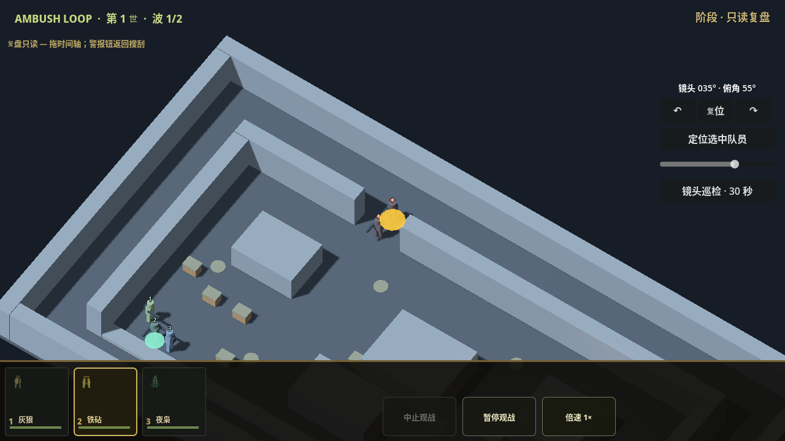

# PR15 独立复验反馈修复

日期：2026-10-02。独立 QA 基线为 `0641771933b1e26bd60cdc3ccccb03b09c32435b`；本作者在静态 loader 后的 a4f3c18 运行诊断复现，相关 main/presenter/replay 基线逻辑未改变。保留 SCOUT → ALERT → SWEEP 和模拟规则；没有加入高度玩法、merge 或生产发布。

## 实际反例与修复

1. 真实 yard 延迟 spawn 的历史定位后，退到事件前一 tick：事件前缀正确消失，但同 attempt/wave 的 3D 定位环仍显示。基线生命周期退出 1，1 个失败。`cc11bb074fd6e8a67f4a3ca81eaf2daf566ad962` 保存聚焦的全局时间，历史时间早于该事件即清环；跨 attempt/wave 的既有清理保留。
2. 旧快照 tick 单调、仅事件 tick 回退时，后段 spawn@0 提前暴露。基线时间测试退出 1，1 个失败。同一 cc11bb0 对快照和事件流分别检测缺少 timeline_tick 的回退，拒绝可靠性不足的回放，保留原数组；单调旧单波和有全局时间的新多波保持兼容，不将旧事件挂到当前 run_id。
3. `apply_touch_command(nade/decoy)` 与底层 helper 能绕阶段锁：ALERT/暂停 ALERT 修改雷点、消耗诱饵，REPLAY 也消耗诱饵。GUI 原本禁用，这个复现证明入口缺守卫，不声明普通禁用按钮可点击到达。`71df99a852780f927aa15a74f67fd0f9b96b6f4d` 在落地 helper 用 `_can_edit_equipment` + modal guard；诱饵也拒绝非有限位置。
4. 真实首波走到 SWEEP，存活且 unlocked 的 MG 的原生按钮有 button_down，但 180°不变；同按钮在 SCOUT 正常转到188°。71df99a 将旋转入口与 HUD 统一为活着、可见、未锁的 SCOUT/SWEEP，保留 MG 8°与匍匐比例。

诊断夹具也经过修正：最初把 MG 按15°断言，真实战斗后工具可能耗尽；修正选中 MG、按8°断言，并在战斗结果后准备合法工具库存。软件渲染长帧会跨越长按连发阈值，因此单次原生按下/释放测试关闭 touch_hud 的 hold-repeat process；独立 legal-only 基线17项仅2个 SWEEP 旋转失败，SCOUT通过。冻结入口10个失败另有完整基线日志。未把夹具误报作为产品缺陷；不借这个单次按键测试证明长按体验或设备性能。

## 固定源码验证

实际命令均在 `/workspace/ambush-pr15` 通过隔离包装器和 StorageGuard；Godot `4.7.2.stable.official.ed1daf0bf`。日志和完成结果见 [验证索引](evidence/20261002-pr15-review-fixes/validation.json)。cc11bb0 的时间66项与原生生命周期/渲染32项均退出0。71df99a 的工具入口、原生 ScreenTouch、装备冻结与六关完整多波结果在该索引逐项记录。

| 固定源码 | 实际结果 / run |
| --- | --- |
| cc11bb0 | REPLAY_TIMELINE_OK checks=66，退出0；7038ea40ebb94d61a8ad960b6bb5afc7 |
| cc11bb0 | PRESENTATION_LIFECYCLE_OK checks=32 failures=0，原生渲染退出0；b70bf8bec16748af9b7bc05a833f8946 |
| 71df99a | PHASE_TOOLS_OK checks=35 failures=0，原生ScreenTouch渲染退出0；cb3bca386ad04e4f9795b094c6ca14ba |
| 71df99a | EQUIPMENT_FREEZE_OK checks=66，退出0；3689f6ffa9694a9490e06cd3f64b0993 |
| 71df99a | CAMPAIGN_REPLAY_OK checks=10296 failures=0，六关全部多波/三变体退出0；1890705f242f44e2b1df66f030f31010 |

六关最初300秒超时退出124，完成五关但缺最终标记，日志保留且不算通过；同源码同测试重跑仅将上限改900秒后退出0。yard/warehouse/pump/railcut/depot/radio终局tick分别1283/1191/907/719/957/1413，事件数34/67/34/38/35/51，与先前相同。最终运行无脚本/资源/泄漏错误，原生渲染仅保留不支持VSync切换的llvmpipe告警。



此图已查看，仅为灰盒原生渲染；事件前一tick清环另有实际断言。旧HUD仍是待修内容，不把图片称完整历史HUD或成品战场验收。

```bash
bash ambush_loop/scripts/run_isolated_test.sh /workspace/.ambush-loop-env/godot/4.7.2/Godot_v4.7.2-stable_linux.x86_64 replay_timeline_test.gd
bash ambush_loop/scripts/run_isolated_test.sh /workspace/.ambush-loop-env/bin/godot-capture presentation_lifecycle_test.gd --render
timeout 300 bash ambush_loop/scripts/run_isolated_test.sh /workspace/.ambush-loop-env/bin/godot-capture phase_tools_test.gd --render
timeout 300 bash ambush_loop/scripts/run_isolated_test.sh /workspace/.ambush-loop-env/godot/4.7.2/Godot_v4.7.2-stable_linux.x86_64 equipment_freeze_test.gd
timeout 900 bash ambush_loop/scripts/run_isolated_test.sh /workspace/.ambush-loop-env/godot/4.7.2/Godot_v4.7.2-stable_linux.x86_64 campaign_replay_test.gd
```

## 待做与接缝

历史 m1911 帧的旧头像/左卡仍会读当前 knife；此项已确认，下一片继续闭合，并加入独立 QA 给出的跨波换枪/匍匐/自动雷、前后 seek、故意污染活体反例。未完成的 HUD 草稿暂存后再修四项反馈，没有混入本次验证提交。

R2 候选 `812261a0d7c29446ab631108feec5389cec2950b` 已 fetch、读取 README/采用范围，并在 git archive 的独立副本只读验证：22/51、零违规、退出0。没有运行资产生成器或修改资产源。R2共享 actors_manifest仍R1，后续必须按 catalog_candidate.json 更新主作者运行台账，不能拿旧 hash 验新资产；R2尚未迁入。已查看优先步枪侧面和工具 fit 图；脸部、肩肘接缝、自然步态/死亡及其他枪专用握持仍未验收，技术通过不等于最终美术通过。

后续仍为历史 HUD→角色动作/装备挂点与完整院子→完整3D回放→A3云端优化→其他五关→完整可追溯APK。六关 headless 多波不等于六关成品视觉；灰盒原生渲染不等于战场资产或设备性能。全部计划制作及云端验证后再讨论模拟器/真机。网页 GPT PLAN/REVIEW：unavailable。
