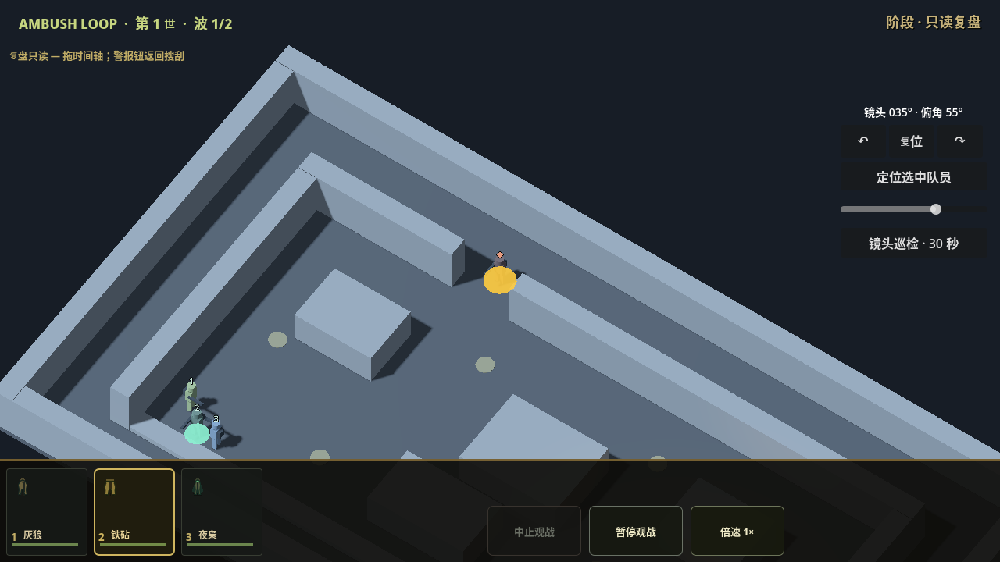
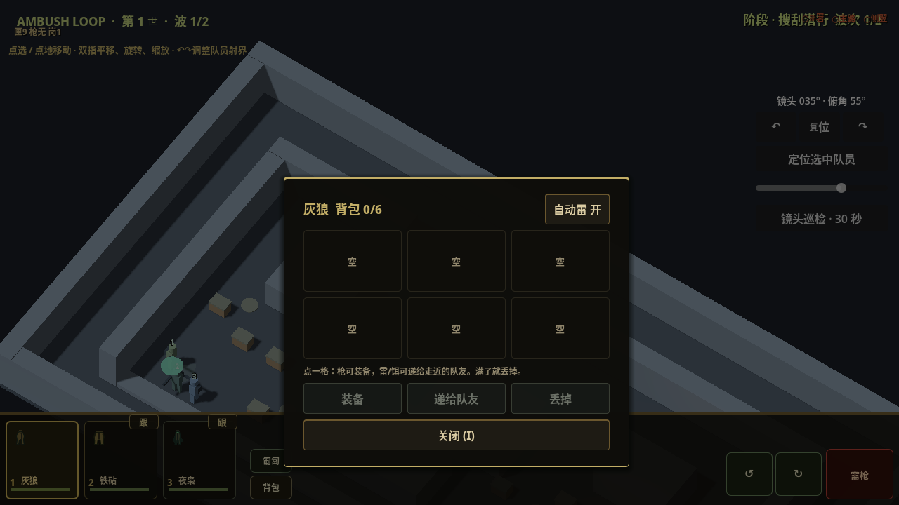
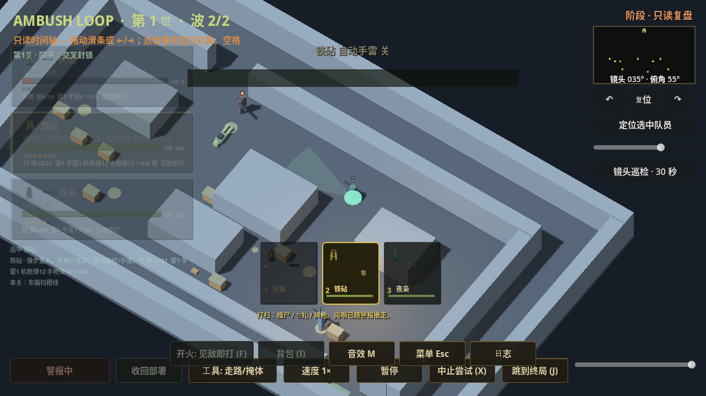

# PR15 回放、装备冻结与输入生命周期报告

日期：2026-10-02。基线 `b766da1c06b3312aac4f7120556d8cbd5d32b8d0`；接管文档 `49bdc40ef5f6cb553296a59181c10330a0d87477`。PR15 保持 Draft/Open，只推送授权分支，不合并、不发布。资产源、图集、角色 GLB/Blender 未改动；Notion 由独立管理工作者维护。

## 已实现切片

| 固定源码 | 改动 | 针对性结果 |
| --- | --- | --- |
| `a2eb22520eae1347a53096d3cf8b84826d516df9` | 记录内独立 attempt ID、wave ID、seq/event ID；全局 `timeline_tick` 与原局部 `tick` 并存；波次起始/最终撤离快照；回放 seek 与历史表现使用记录身份 | 隔离回放 64 项退出 0；表现合同 84,039 项退出 0，72 镜头姿态、48,416 地面样本；参考战斗 tick 1056/22 事件，30/60 FPS 与 2×一致 |
| `0267a6d0a3a209f5ee2ec983a66f0a8f44bc7fff` | SCOUT/SWEEP 才可开背包或换枪/递装/丢弃/改自动雷策略；ALERT、暂停 ALERT、REPLAY 拒绝；阶段切换关包；HUD 锁态与 actor locked 二级守卫；自动雷策略在背包标题区配置 | 隔离装备测试 66 项退出 0；实际 3D 原生输入回归 38 项退出 0 |
| `7d34867eab51f0fddd4b44921a627aa66fe8651d` | 原生 Escape/Android Back 先关背包；取消菜单/背包/后台/重试/波次/回放的未提交触控；取消后的触点等待全部释放，后台丢失 release 时清理；3D 历史事件镜头/标记 | 手势 23 项退出 0；原生生命周期测试开发运行 27 项退出 0；后续固定树渲染复验见下文 |
| `978e27a21025cab50fcc7d18b26f836b868afea8` | 新增六关完整多波回放不变量测试及两平台隔离白名单；runtime 与 7d34867 相同 | 最终回放 64 项退出 0；固定树原生生命周期+渲染 29 项退出 0；完整六关多波 10,296 项退出 0 |

## 实际复现与兼容边界

在接管基线逻辑上，通过第一波实际参考战斗清场、调用真实 SWEEP 下一波入口，再跑第二波，复现后续波时间早于第一波、seek 返回第一波帧和首波时点读到后续波出生事件。装备基线测试退出 1，出现 14 个拒绝反例，包括 ALERT/暂停 ALERT 的开包、换枪、递装、丢弃及自动雷修改，以及 REPLAY 的开包、换枪、丢弃和自动雷修改。

基线回放 harness 另有一个随后校正的断言：第一波 tick 0 本身也有合法出生事件，不能断言该时点只有 door。修复后的测试比较实际首波 tick 0 的完整事件集合，仍验证后续波事件不提前暴露；不把这条 harness 数量错误作为产品缺陷。

`run_id` 继续用于中断旧协程，记录身份不依赖它。新事件 ID 为记录内 `(attempt_id, wave_id, seq)`；进入后续波或改变当前 run token 不改历史身份。局部 tick 保留，模拟 60 Hz、生成时序、路线/数值/胜负未修改；只有回放时间使用单调的全局 tick。跨波同 actor ID 不被重新挂到当前 token，连击摘要不跨波串联。

旧单波/单调 tick 的快照和事件使用原时间，缺少装备字段继续中性兼容，不读活体补写。旧记录如果已出现 tick 回退且没有波次信息，就不能可靠判断快照与事件的对应关系；保留原数组并明确提示无法可靠复盘，不混帧、不猜分段。这不等于完成旧混合多波数据的恢复迁移。

## 实际命令与证据

均在 `/workspace/ambush-pr15` 通过 StorageGuard 与隔离包装器运行；Godot 输出 `4.7.2.stable.official.ed1daf0bf`。固定引擎为 `/workspace/.ambush-loop-env/godot/4.7.2/Godot_v4.7.2-stable_linux.x86_64`。

```bash
bash ambush_loop/scripts/run_isolated_test.sh /workspace/.ambush-loop-env/godot/4.7.2/Godot_v4.7.2-stable_linux.x86_64 editor_import
bash ambush_loop/scripts/run_isolated_test.sh /workspace/.ambush-loop-env/godot/4.7.2/Godot_v4.7.2-stable_linux.x86_64 replay_timeline_test.gd
bash ambush_loop/scripts/run_isolated_test.sh /workspace/.ambush-loop-env/godot/4.7.2/Godot_v4.7.2-stable_linux.x86_64 presentation_contract_test.gd
bash ambush_loop/scripts/run_isolated_test.sh /workspace/.ambush-loop-env/godot/4.7.2/Godot_v4.7.2-stable_linux.x86_64 equipment_freeze_test.gd
bash ambush_loop/scripts/run_isolated_test.sh /workspace/.ambush-loop-env/godot/4.7.2/Godot_v4.7.2-stable_linux.x86_64 presentation_interaction_test.gd
bash ambush_loop/scripts/run_isolated_test.sh /workspace/.ambush-loop-env/godot/4.7.2/Godot_v4.7.2-stable_linux.x86_64 camera_input_test.gd
bash ambush_loop/scripts/run_isolated_test.sh /workspace/.ambush-loop-env/bin/godot-capture presentation_lifecycle_test.gd --render
bash ambush_loop/scripts/run_isolated_test.sh /workspace/.ambush-loop-env/godot/4.7.2/Godot_v4.7.2-stable_linux.x86_64 campaign_replay_test.gd
bash ambush_loop/scripts/run_isolated_test.sh /workspace/.ambush-loop-env/godot/4.7.2/Godot_v4.7.2-stable_linux.x86_64 smoke_test.gd
```

`godot-capture` 是环境的 Godot 4.7.2 X11/Compatibility/Dummy audio 包装器；本轮按需启动 Xorg dummy 屏幕。第一次直接渲染有 ALSA 初始化错误并回退 Dummy，未选作最终通过证据；改用显式 Dummy 包装器后复验退出 0、29 项完成，无脚本/音频错误，保留 llvmpipe 不支持 VSync 切换的驱动告警。软件渲染不证明手机性能。

[验证索引](evidence/20261002-pr15-runtime/validation.json) 保存 source SHA、entry、实际退出码、run ID 和日志/图片 SHA-256。日志和精选图在同目录。初始 editor_import 退出 0，run `c244d7bd9104475fbfac8b751efe003d`；回放/冻结基线退出 1，完整日志留存。正式通过以具体运行的退出码和末尾完成标记一起认定。





图片为灰盒真实运行：确认事件定位标记、按钮和面板的可见性；不代表人物/院子成品接入或新版 HUD 验收。当前旧 HUD 的信息拥挤仍属 A2 待改项。

## 完成与待验

- `7d34867` 完整六夜 smoke：固定源码副本重跑退出 0，run `1ed3dd3ab66f44dcbca13526cf45caef`；含 `SMOKE_OK_LAUNCH_BAR`、`SMOKE_OK_RAID_LOOP`、`SMOKE_OK_TYPICAL_LOOPS yard,warehouse,pump,railcut,depot,radio` 和 `SMOKE_SLICE_COMPLETE`，无脚本错误。首次运行虽完成全部关卡，但 shell 包装器因运行时文件被更新返回 127；此失败也归档，不认定为通过。重跑采用 git archive 固定树，避免包装器改写。完整 smoke 覆盖首三项修复；后续历史字段源 17aba59 的定向/六关回归另列，不能冒充同 SHA 完整 smoke。
- `978e27a` 六关完整多波回放：已完成，退出 0、`CAMPAIGN_REPLAY_OK checks=10296 failures=0`。使用既有参考武器/阵地与 authored 掉落；SWEEP 使用与 full smoke 相同的 `raid_vacuum_loot`，没有额外授予弹药。它是模拟与回放测试，不能替代物理走近搜刮、全六关成品视觉或设备测试。
- `17aba59df7a4ddd5c98986f12c07125d0bed8190` 增加历史画面格式 1：装备/背包/姿态/朝向/工具/哨兵/场景及选择；渲染 44 项、表现合同 84,039 项、六关多波 10,296 项、时间身份 64 项、原生生命周期渲染 29 项均退出 0。细节见 [格式文档](AMBUSH_REPLAY_VISUAL_SCHEMA_20261002.md)。完整历史 HUD、角色动画、事件特效/声音与 LOD 仍待接入，不能称全 3D 回放完成。
- 已收到角色候选 `0242c983e8ae972b58b4f7afe9d08084b8f421c6`，在固定远程文件的独立副本只读复核二进制退出 0，22/51、零违规；人物 16 LOD 的重复生成 hash 不一致仍阻碍可复现验收。武器/工具的重复哈希一致；材质 mapping/文件级迁入进入下一切片。完整院子/HUD/45 cue、A3 云端优化、A4 五关主题及完整可追溯 APK 未完成。
- 模拟器、真机触控/后台与中端持续 30 FPS/高配可选 60 FPS 均待全部计划制作和云端验证后安排；当前未启动模拟器或要求安装。

## 下一步与可并行包

六关回放与首三项修复的完整 smoke 已通过，继续推进历史 HUD 和资产文件级接入。按 [所有权和资产接口](AMBUSH_PR15_INTEGRATION_20261002.md) 接收人物重建一致性修复和专用握持提交，不整体合并 WIP；先处理可重复静态装备和材质分流，再推进角色 runtime 与完整院子。可以由 dot 分派独立音频包：只写 `audio/v2/` 与独立 45 cue 映射候选/生成说明/响度和峰值/来源及哈希，不改 AudioDirector/main/共享 manifest。Notion 管理继续单写者。网页 GPT PLAN/REVIEW：unavailable。

新增固定源码复验命令仍使用同一隔离包装器：`visual_snapshot_test.gd --render`（godot-capture）、`presentation_contract_test.gd`、`campaign_replay_test.gd`。首三项完整 smoke 的实际工作目录为 `/tmp/ambush-pr15-smoke-7d34867`，由 `git archive 7d34867eab51f0fddd4b44921a627aa66fe8651d` 建立并先隔离 editor_import；其命令与上文 smoke 一致。


