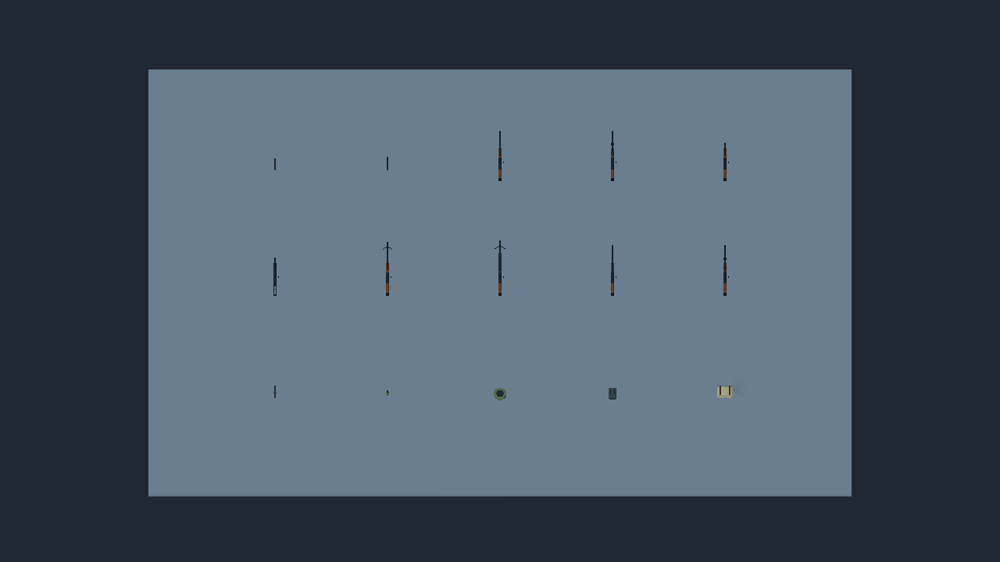
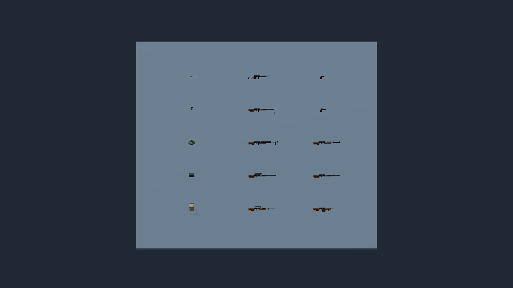

# PR15 静态装备与资源加载切片

日期：2026-10-02。继承完整执行顺序 v2；本次只接收固定候选的静态装备与 atlas 原字节，并验证 runtime loader 和独立 PCK。角色、握持、院子/六关、历史动作与 APK 继续施工；本报告不替代战场或设备验收。

## 来源与实现

候选源：`0242c983e8ae972b58b4f7afe9d08084b8f421c6`。先在 git archive 的只读副本复验 binary validator，22 件 / 51 LOD、零违规、退出 0，没有运行 Blender 或生成器。仅迁入 10 枪 + 5 工具的 30 GLB 和 3 PNG，文件 SHA-256 与候选逐项相同。人物 16 LOD 重复导出差异、专用握持和皮肤品质仍由资产工作者修复；没有迁入人物或整体合并 WIP。

实现源：`66d423e93d6e10d3eb20694e0808664a9b00bec6`；最终验证源：`a870eb5803355a52bb0afcb0015cea4472c4f858`。loader 合并 yard 与静态装备目录、拒绝未知 ID/LOD/材质槽，返回元数据副本；actor atlas 独立懒加载，Normal scale 0.4，ORM G=roughness、B=metallic，保留 yard 和灯具材质。旧三件 yard 的实际导入几何与材质也回归。模型不添加碰撞或导航；导出预设显式包含 `art/v2/*manifest.json`。

新增隔离 PCK 检查：包装器建立空物理 project 目录，只从 `--main-pack` 取资源，避免工作树文件掩盖漏打包。PowerShell 同步实现但尚未在 Windows 运行。

## 固定源码实际验证

Godot：`4.7.2.stable.official.ed1daf0bf`。工作目录：`/workspace/ambush-pr15`。所有运行使用隔离存档和 StorageGuard；日志、图片、32 张捕获索引与 SHA-256 见 [验证索引](evidence/20261002-pr15-static-equipment/validation.json)。

| 检查 | 实际结果 |
| --- | --- |
| `asset_library_test.gd --render` | 退出 0，`ASSET_LIBRARY_OK checks=257 failures=0 assets=15 lods=30`；run `659d0df4202345148c2a849b1fcfd819`；包含原字节、材质分流、实际三角面/挂点、无碰撞/导航、旧 yard 和两 LOD/两俯仰/八方向图 |
| Linux Desktop `--export-pack` | 退出 0，无 ERROR/SCRIPT ERROR；隔离 XDG 配置，PCK 9,466,376 bytes，SHA-256 `fa5fe78e53c140831b558303a199d6e4ef14d5a1641e11cee41d1de081117bf7` |
| 空目录 `asset_pack_test.gd` | 退出 0，`ASSET_PACK_OK checks=35 failures=0`；run `9ac1659012d34a0bb29da5101ee55531`；包内 manifest、30 LOD、纹理和旧 yard 可加载，人物未登记 |

```bash
bash ambush_loop/scripts/run_isolated_test.sh /workspace/.ambush-loop-env/bin/godot-capture asset_library_test.gd --render
XDG_DATA_HOME=/tmp/pr15-export-434b042/data XDG_CONFIG_HOME=/tmp/pr15-export-434b042/config XDG_CACHE_HOME=/tmp/pr15-export-434b042/cache /workspace/.ambush-loop-env/godot/4.7.2/Godot_v4.7.2-stable_linux.x86_64 --headless --path ambush_loop --export-pack 'Linux Desktop' /tmp/pr15-static-a870eb5.pck
AMBUSH_TEST_PACK=/tmp/pr15-static-a870eb5.pck timeout 120 bash ambush_loop/scripts/run_isolated_test.sh /workspace/.ambush-loop-env/godot/4.7.2/Godot_v4.7.2-stable_linux.x86_64 asset_pack_test.gd
python3 /tmp/pr15-actor-candidate-0242/ambush_loop/ArtSource/v2/actor_acceptance/validate.py --project /tmp/pr15-actor-candidate-0242/ambush_loop --output /tmp/pr15-actor-candidate-binary.json
```

早期 harness 有 AudioStreamWAV/Playback 泄漏告警，修复暂停音乐并等待 Dummy playback flush 后固定源复验消失；第一次 PCK 检查使用错误 OS 方法产生 parser error，修正后重导出、重查通过，未将早期失败记成通过。最终软件渲染仅有 llvmpipe 不支持 VSync 切换的驱动告警，不证明手机性能。





已查看这两图：网格模型可见，部分枪在俯视方向过细；fixture 没有角色或握持。这里只证明加载/渲染和包内资源契约，不能称战场辨识度、最终美术、人物动画或设备性能通过。PCK 是资源验证包，并非完整可追溯 APK。

## 后续与接口

主作者继续历史 HUD：role card、portrait、minimap、标题及装备标签只能读历史快照，旧字段中性回退。随后接动作时间采样、角色/装备挂点、完整院子和六关。资产工作者提交可重复人物 LOD 与分武器族握持的独立固定候选，保留骨名、挂点、单位、材质槽契约；主作者负责 runtime manifest/loader 和验收。独立音频 45 cue 包可由 dot 安排，不改 main/AudioDirector/共享 manifest。网页 GPT PLAN/REVIEW：unavailable。
